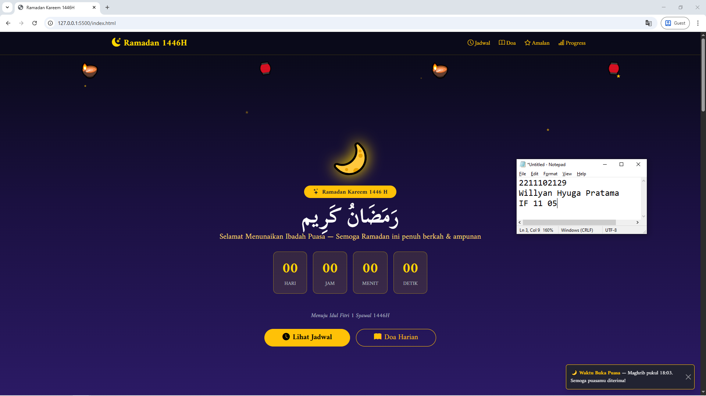

<div align="center">
  <br />
  <h1>LAPORAN PRAKTIKUM <br> APLIKASI BERBASIS PLATFORM </h1>
  <br />
  <h3>MODUL 4 <br> Bootstrap </h3>
  <br />
  
  <br />
  <br />
  <br />
  <h3>Disusun Oleh :</h3>
  <p>
    <strong>Willyan Hyuga Pratama</strong>
    <br>
    <strong>2211102129</strong>
    <br>
    <strong>S1 IF-11-REG05</strong>
  </p>
  <br />
  <h3>Dosen Pengampu :</h3>
  <p>
    <strong>Dedi Agung Prabowo, S.Kom., M.Kom</strong>
  </p>
  <br />
  <br />
  <h4>Asisten Praktikum :</h4>
  <strong>Apri Pandu Wicaksono </strong>
  <br>
  <strong>Hamka Zaenul Ardi</strong>
  <br />
  <h3>LABORATORIUM HIGH PERFORMANCE <br>FAKULTAS INFORMATIKA <br>UNIVERSITAS TELKOM PURWOKERTO <br>2026 </h3>
</div>

<hr>

# Dasar Teori Bootstrap

## 1. Pengertian Bootstrap
Bootstrap adalah kerangka kerja (framework) open-source berbasis CSS, HTML, dan JavaScript yang paling populer di dunia untuk pengembangan web yang responsif serta mengutamakan tampilan mobile (*mobile-first*). Awalnya dikembangkan oleh tim Twitter, Bootstrap kini menjadi standar industri karena kemampuannya menyederhanakan proses desain interface tanpa harus menulis banyak kode CSS manual.

## 2. Fitur Utama Bootstrap
*   **Responsive Grid System**: Menggunakan sistem grid berbasis flexbox yang membagi halaman menjadi 12 kolom, memungkinkan tata letak yang adaptif di berbagai ukuran perangkat.
*   **Mobile-First Approach**: Kode Bootstrap dioptimalkan untuk perangkat seluler terlebih dahulu, kemudian ditingkatkan skalanya untuk layar yang lebih besar menggunakan media queries.
*   **Pre-styled Components**: Menyediakan katalog komponen antarmuka siap pakai yang kaya, seperti Navbar, Button, Card, Modal, Carousel, dan lainnya.
*   **Utility-First Classes**: Kumpulan class utilitas untuk mengatur margin, padding, warna, tipografi, dan perataan secara instan.
*   **JavaScript Plugins**: Integrasi fungsionalitas interaktif yang sudah teruji, seperti toggle dropdown, modal pop-up, dan tooltip menggunakan Vanilla JS (versi terbaru) atau Popper.js.

## 3. Sistem Grid Bootstrap
Sistem grid Bootstrap adalah fondasi utama dalam pembuatan layout. Komponen utamanya adalah:
1.  **Container**: Elemen pembungkus utama untuk menyelaraskan dan memusatkan konten (`.container` atau `.container-fluid`).
2.  **Row**: Bertindak sebagai pembungkus horizontal untuk kolom dan memastikan kolom sejajar dengan benar (`.row`).
3.  **Column**: Unit terkecil yang menentukan lebar konten dalam baris (`.col-*`). Total kolom dalam satu baris adalah 12.

Bootstrap menggunakan **Breakpoints** sebagai ambang batas lebar layar untuk perubahan tata letak:
- **Extra Small (xs)**: < 576px
- **Small (sm)**: ≥ 576px
- **Medium (md)**: ≥ 768px
- **Large (lg)**: ≥ 992px
- **Extra Large (xl)**: ≥ 1200px
- **Extra Extra Large (xxl)**: ≥ 1400px

## 4. Utility Classes & Typography
Beberapa kategori utilitas yang sangat penting dalam Bootstrap 5:
*   **Spacing**: Menggunakan format `{property}{sides}-{size}` (contoh: `mt-3`, `px-5`) dengan skala 1 sampai 5.
*   **Colors**: Memanfaatkan palet warna semantik seperti `primary`, `secondary`, `success`, `danger`, `warning`, `info`, `light`, dan `dark`.
*   **Typography**: Class seperti `.display-1..6`, `.fw-bold`, dan `.text-center` untuk kontrol teks yang presisi.
*   **Flexbox & Grid Utilities**: Kontrol penuh atas tata letak fleksibel dengan class seperti `d-flex`, `justify-content-between`, dan `align-items-center`.


### Source code - html
```html
<!DOCTYPE html>
<html lang="id" data-bs-theme="dark">
<head>
  <meta charset="UTF-8" />
  <meta name="viewport" content="width=device-width, initial-scale=1.0" />
  <title>Ramadan Kareem 1446H</title>
  <link href="https://cdn.jsdelivr.net/npm/bootstrap@5.3.3/dist/css/bootstrap.min.css" rel="stylesheet" />
  <link href="https://cdn.jsdelivr.net/npm/bootstrap-icons@1.11.3/font/bootstrap-icons.min.css" rel="stylesheet" />
  <link href="https://fonts.googleapis.com/css2?family=Amiri:ital,wght@0,400;0,700;1,400&family=Scheherazade+New:wght@400;700&display=swap" rel="stylesheet" />
  <style>
    body { font-family: 'Amiri', serif; background-color: #0a0a1a; }
    .hero-bg { background: linear-gradient(180deg, #0a0a1a 0%, #1a1040 40%, #2d1b69 100%); min-height: 100vh; }
    .moon-glow { text-shadow: 0 0 40px #ffd700, 0 0 80px #ffaa00; }
    .gold-text { color: #ffd700; }
    .lantern { animation: swing 3s ease-in-out infinite; transform-origin: top center; display: inline-block; }
    .lantern:nth-child(2) { animation-delay: 0.5s; }
    .lantern:nth-child(3) { animation-delay: 1s; }
    .lantern:nth-child(4) { animation-delay: 1.5s; }
    @keyframes swing { 0%,100% { transform: rotate(-8deg); } 50% { transform: rotate(8deg); } }
    .star-twinkle { animation: twinkle 2s ease-in-out infinite; }
    @keyframes twinkle { 0%,100% { opacity: 1; } 50% { opacity: 0.3; } }
    .progress-custom { background-color: #2d1b69; border-radius: 50px; }
    .progress-bar-custom { background: linear-gradient(90deg, #ffd700, #ff8c00); }
    .card-ramadan { background: rgba(255,255,255,0.05); border: 1px solid rgba(255,215,0,0.3); backdrop-filter: blur(10px); }
    .font-arabic { font-family: 'Scheherazade New', serif; font-size: 2rem; line-height: 1.8; }
    .countdown-box { background: rgba(255,215,0,0.1); border: 1px solid rgba(255,215,0,0.4); border-radius: 12px; min-width: 80px; }
  </style>
</head>
<body>

<!-- NAVBAR -->
<nav class="navbar navbar-expand-lg navbar-dark sticky-top" style="background: rgba(10,10,26,0.9); backdrop-filter: blur(12px); border-bottom: 1px solid rgba(255,215,0,0.2);">
  <div class="container">
    <a class="navbar-brand fw-bold fs-4 gold-text" href="#">
      <i class="bi bi-moon-stars-fill me-2"></i>Ramadan 1446H
    </a>
    <button class="navbar-toggler border-warning" type="button" data-bs-toggle="collapse" data-bs-target="#navMenu">
      <span class="navbar-toggler-icon"></span>
    </button>
    <div class="collapse navbar-collapse" id="navMenu">
      <ul class="navbar-nav ms-auto gap-2">
        <li class="nav-item"><a class="nav-link text-warning" href="#jadwal"><i class="bi bi-clock me-1"></i>Jadwal</a></li>
        <li class="nav-item"><a class="nav-link text-warning" href="#doa"><i class="bi bi-book me-1"></i>Doa</a></li>
        <li class="nav-item"><a class="nav-link text-warning" href="#amalan"><i class="bi bi-star me-1"></i>Amalan</a></li>
        <li class="nav-item"><a class="nav-link text-warning" href="#progress"><i class="bi bi-bar-chart me-1"></i>Progress</a></li>
      </ul>
    </div>
  </div>
</nav>

<!-- HERO -->
<section class="hero-bg d-flex align-items-center position-relative overflow-hidden">

  <!-- Stars -->
  <div class="position-absolute top-0 start-0 w-100 h-100 pe-none">
    <span class="position-absolute star-twinkle text-warning" style="top:8%;left:12%;font-size:0.5rem;">&#9733;</span>
    <span class="position-absolute star-twinkle text-warning" style="top:15%;left:35%;font-size:0.7rem;animation-delay:0.3s;">&#9733;</span>
    <span class="position-absolute star-twinkle text-warning" style="top:6%;left:60%;font-size:0.4rem;animation-delay:0.7s;">&#9733;</span>
    <span class="position-absolute star-twinkle text-warning" style="top:20%;left:78%;font-size:0.6rem;animation-delay:1.1s;">&#9733;</span>
    <span class="position-absolute star-twinkle text-warning" style="top:30%;left:90%;font-size:0.5rem;animation-delay:0.5s;">&#9733;</span>
    <span class="position-absolute star-twinkle text-warning" style="top:5%;left:88%;font-size:0.8rem;animation-delay:1.5s;">&#9733;</span>
  </div>

  <!-- Lanterns row -->
  <div class="position-absolute top-0 w-100 d-flex justify-content-around pt-3">
    <span class="lantern fs-1">🪔</span>
    <span class="lantern fs-2">🏮</span>
    <span class="lantern fs-1">🪔</span>
    <span class="lantern fs-2">🏮</span>
  </div>

  <div class="container py-5 mt-5 text-center text-white">
    <!-- Moon emoji as hero -->
    <div class="display-1 moon-glow mb-3">🌙</div>

    <span class="badge bg-warning text-dark fw-bold px-4 py-2 rounded-pill fs-6 mb-3 d-inline-block">
      <i class="bi bi-stars me-1"></i> Ramadan Kareem 1446 H
    </span>

    <h1 class="display-4 fw-bold text-white mb-2" style="font-family:'Scheherazade New',serif;">
      رَمَضَانُ كَرِيم
    </h1>
    <p class="lead text-warning-emphasis mb-4" style="font-family:'Amiri',serif;font-size:1.3rem;">
      Selamat Menunaikan Ibadah Puasa — Semoga Ramadan ini penuh berkah &amp; ampunan
    </p>

    <!-- Countdown -->
    <div class="d-flex justify-content-center gap-3 mb-5 flex-wrap">
      <div class="countdown-box text-center px-4 py-3">
        <div class="fs-1 fw-bold gold-text" id="cd-day">00</div>
        <div class="text-muted small text-uppercase">Hari</div>
      </div>
      <div class="countdown-box text-center px-4 py-3">
        <div class="fs-1 fw-bold gold-text" id="cd-hour">00</div>
        <div class="text-muted small text-uppercase">Jam</div>
      </div>
      <div class="countdown-box text-center px-4 py-3">
        <div class="fs-1 fw-bold gold-text" id="cd-min">00</div>
        <div class="text-muted small text-uppercase">Menit</div>
      </div>
      <div class="countdown-box text-center px-4 py-3">
        <div class="fs-1 fw-bold gold-text" id="cd-sec">00</div>
        <div class="text-muted small text-uppercase">Detik</div>
      </div>
    </div>

    <!-- Selebihnya dapat cek pada file "index.html" -->
```
🔗 [Klik di sini untuk membuka file `index.html`](index.html)

Output:


## Penjelasan
Website ini merupakan dashboard interaktif bertema Ramadan 1446H yang dirancang untuk memantau progres ibadah, jadwal sholat, dan kumpulan doa harian. Menggunakan framework Bootstrap 5, situs ini menyuguhkan antarmuka modern dengan dark mode estetis, lengkap dengan fitur countdown otomatis menuju Idul Fitri.