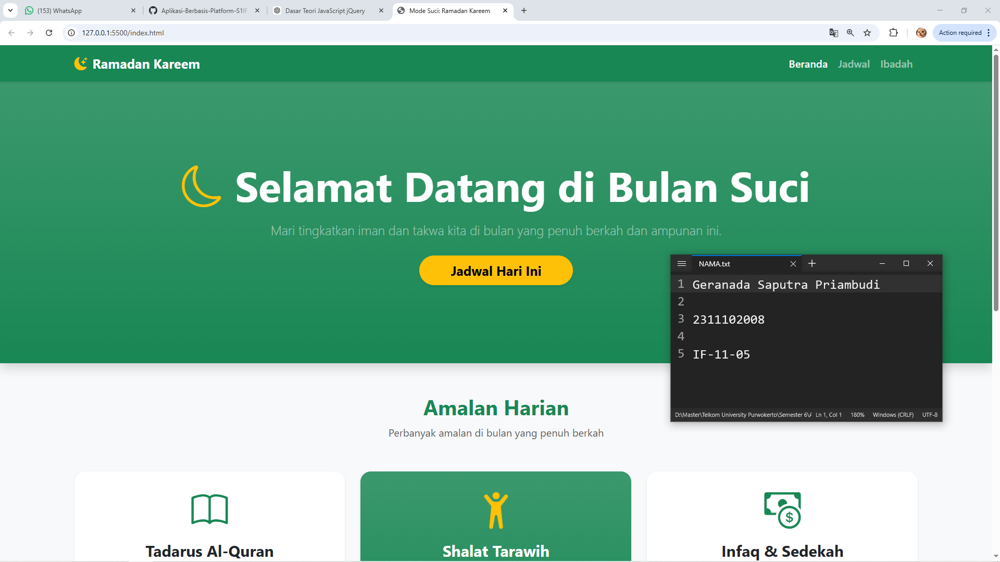
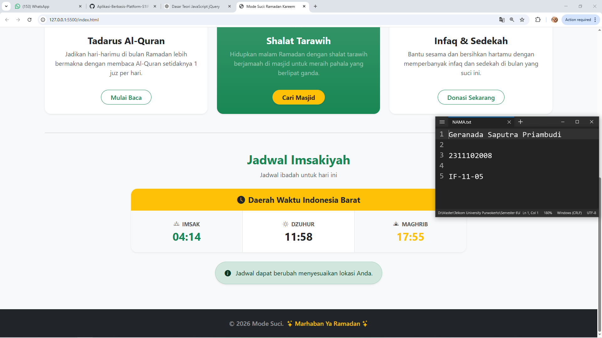

<div align="center">
  <br />
  <h1>LAPORAN PRAKTIKUM <br> APLIKASI BERBASIS PLATFORM </h1>
  <br />
  <h3>MODUL 4 <br> Bootstrap </h3>
  <br />
  
  <br />
  <br />
  <br />
  <h3>Disusun Oleh :</h3>
  <p>
    <strong>Geranada Saputra Priambudi</strong>
    <br>
    <strong>2311102008</strong>
    <br>
    <strong>S1 IF-11-REG05</strong>
  </p>
  <br />
  <h3>Dosen Pengampu :</h3>
  <p>
    <strong>Dedi Agung Prabowo, S.Kom., M.Kom</strong>
  </p>
  <br />
  <br />
  <h4>Asisten Praktikum :</h4>
  <strong>Apri Pandu Wicaksono </strong>
  <br>
  <strong>Hamka Zaenul Ardi</strong>
  <br />
  <h3>LABORATORIUM HIGH PERFORMANCE <br>FAKULTAS INFORMATIKA <br>UNIVERSITAS TELKOM PURWOKERTO <br>2026 </h3>
</div>

<hr>

# Dasar Teori Bootstrap

## Bootstrap
1. Pengertian Bootstrap

Bootstrap adalah framework CSS yang digunakan untuk mempermudah pengembangan tampilan (front-end) website agar lebih cepat, responsif, dan konsisten. Bootstrap menyediakan kumpulan class siap pakai untuk desain layout, komponen UI, serta styling tanpa harus menulis CSS dari nol.

2. Fungsi dan Kegunaan Bootstrap

Bootstrap digunakan untuk:

Membuat tampilan website yang responsif (menyesuaikan berbagai ukuran layar)
Mempercepat proses desain antarmuka (UI)
Menyediakan komponen siap pakai seperti navbar, card, button, modal, dll
Menjaga konsistensi desain antar halaman
3. Kelebihan Bootstrap

Beberapa keunggulan Bootstrap antara lain:

Mudah digunakan, bahkan untuk pemula
Responsive grid system (12 kolom)
Banyak komponen UI siap pakai
Dokumentasi lengkap
Mendukung berbagai browser (cross-browser)
4. Sistem Grid pada Bootstrap

Bootstrap menggunakan sistem grid berbasis 12 kolom yang memungkinkan developer mengatur layout dengan mudah. Grid ini bersifat fleksibel dan responsif.


### Source code - html
```html
<!DOCTYPE html>
<html lang="id">
<head>
    <meta charset="UTF-8">
    <meta name="viewport" content="width=device-width, initial-scale=1.0">
    <title>Mode Suci: Ramadan Kareem</title>
    <!-- Bootstrap CSS -->
    <link href="https://cdn.jsdelivr.net/npm/bootstrap@5.3.3/dist/css/bootstrap.min.css" rel="stylesheet">
    <!-- Bootstrap Icons -->
    <link href="https://cdn.jsdelivr.net/npm/bootstrap-icons@1.11.3/font/bootstrap-icons.min.css" rel="stylesheet">
</head>
<body class="bg-light">

    <!-- Navbar -->
    <nav class="navbar navbar-expand-lg navbar-dark bg-success shadow-sm">
        <div class="container">
            <a class="navbar-brand fw-bold" href="#"><i class="bi bi-moon-stars-fill text-warning me-2"></i>Ramadan Kareem</a>
            <button class="navbar-toggler" type="button" data-bs-toggle="collapse" data-bs-target="#navbarNav">
                <span class="navbar-toggler-icon"></span>
            </button>
            <div class="collapse navbar-collapse" id="navbarNav">
                <ul class="navbar-nav ms-auto fw-medium">
                    <li class="nav-item">
                        <a class="nav-link active" href="#">Beranda</a>
                    </li>
                    <li class="nav-item">
                        <a class="nav-link" href="#jadwal">Jadwal</a>
                    </li>
                    <li class="nav-item">
                        <a class="nav-link" href="#amalan">Ibadah</a>
                    </li>
                </ul>
            </div>
        </div>
    </nav>

    <!-- Selebihnya dapat cek pada file "index.html" -->
```
🔗 [Klik di sini untuk membuka file `index.html`](index.html)

Output:



## Penjelasan
website landing page bertema Ramadan yang menampilkan informasi amalan harian (seperti tadarus, tarawih, dan sedekah) serta jadwal imsakiyah. Website ini dirancang menggunakan Bootstrap agar tampil modern, responsif, dan interaktif bagi pengguna.