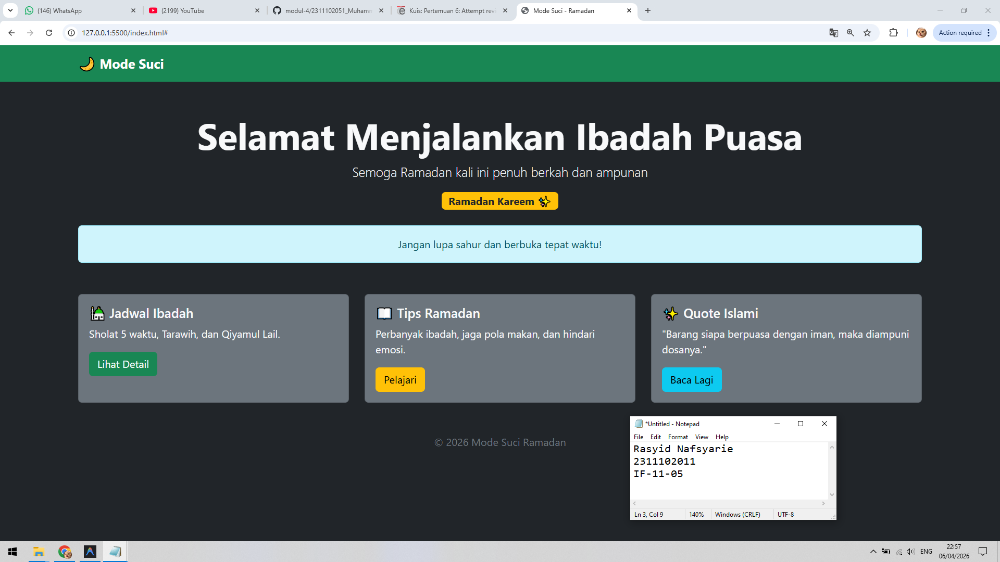

<div align="center">
  <br />
  <h1>LAPORAN PRAKTIKUM <br> APLIKASI BERBASIS PLATFORM </h1>
  <br />
  <h3>MODUL 4 <br> Bootstrap </h3>
  <br />
  
  <br />
  <br />
  <br />
  <h3>Disusun Oleh :</h3>
  <p>
    <strong>Rasyid Nafsyarie</strong>
    <br>
    <strong>2311102011</strong>
    <br>
    <strong>S1 IF-11-REG05</strong>
  </p>
  <br />
  <h3>Dosen Pengampu :</h3>
  <p>
    <strong>Dedi Agung Prabowo, S.Kom., M.Kom</strong>
  </p>
  <br />
  <br />
  <h4>Asisten Praktikum :</h4>
  <strong>Apri Pandu Wicaksono </strong>
  <br>
  <strong>Hamka Zaenul Ardi</strong>
  <br />
  <h3>LABORATORIUM HIGH PERFORMANCE <br>FAKULTAS INFORMATIKA <br>UNIVERSITAS TELKOM PURWOKERTO <br>2026 </h3>
</div>

<hr>

# Dasar Teori Bootstrap

## Pengertian Bootstrap
Bootstrap adalah framework CSS (dan JavaScript) open-source yang digunakan untuk membangun antarmuka website yang responsive, cepat, dan konsisten. Bootstrap menyediakan kumpulan class siap pakai seperti layout grid, typography, button, form, dan komponen UI lainnya sehingga developer tidak perlu menulis CSS dari nol.

Bootstrap merupakan framework front-end yang dikembangkan untuk mempermudah proses pembuatan tampilan website yang responsif dan mobile-first. Dengan menggunakan sistem grid berbasis 12 kolom serta berbagai komponen siap pakai seperti navbar, card, button, dan alert, Bootstrap memungkinkan pengembang untuk membangun antarmuka pengguna secara cepat dan konsisten tanpa harus menulis banyak kode CSS secara manual. Selain itu, Bootstrap juga mendukung kompatibilitas lintas browser dan menyediakan utilitas class untuk pengaturan layout, warna, dan spacing.

## Contoh Implementasi
```html
<button class="btn btn-primary">Klik Saya</button>
```

### Source code - html
```html
<!DOCTYPE html>
<html lang="id">
<head>
    <meta charset="UTF-8">
    <title>Mode Suci - Ramadan</title>
    <link href="https://cdn.jsdelivr.net/npm/bootstrap@5.3.0/dist/css/bootstrap.min.css" rel="stylesheet">
</head>
<body class="bg-dark text-light">

    <nav class="navbar navbar-expand-lg navbar-dark bg-success">
        <div class="container">
            <a class="navbar-brand fw-bold">🌙 Mode Suci</a>
            <button class="navbar-toggler" data-bs-toggle="collapse" data-bs-target="#navbarNav">
                <span class="navbar-toggler-icon"></span>
            </button>
        </div>
    </nav>

    <div class="container text-center mt-5">
        <h1 class="display-4 fw-bold">Selamat Menjalankan Ibadah Puasa</h1>
        <p class="lead">Semoga Ramadan kali ini penuh berkah dan ampunan</p>
        <span class="badge bg-warning text-dark fs-6">Ramadan Kareem ✨</span>
    </div>

    <div class="container mt-4">
        <div class="alert alert-info text-center" role="alert">
            Jangan lupa sahur dan berbuka tepat waktu!
        </div>
    </div>

Output:

```

## Penjelasan
Halaman ini dibuat menggunakan Bootstrap dengan memanfaatkan class bawaan seperti navbar, container, card, dan btn untuk membangun tampilan Ramadan yang responsif tanpa CSS custom. Struktur layout menggunakan sistem grid Bootstrap sehingga desain tetap rapi dan konsisten di berbagai ukuran layar.