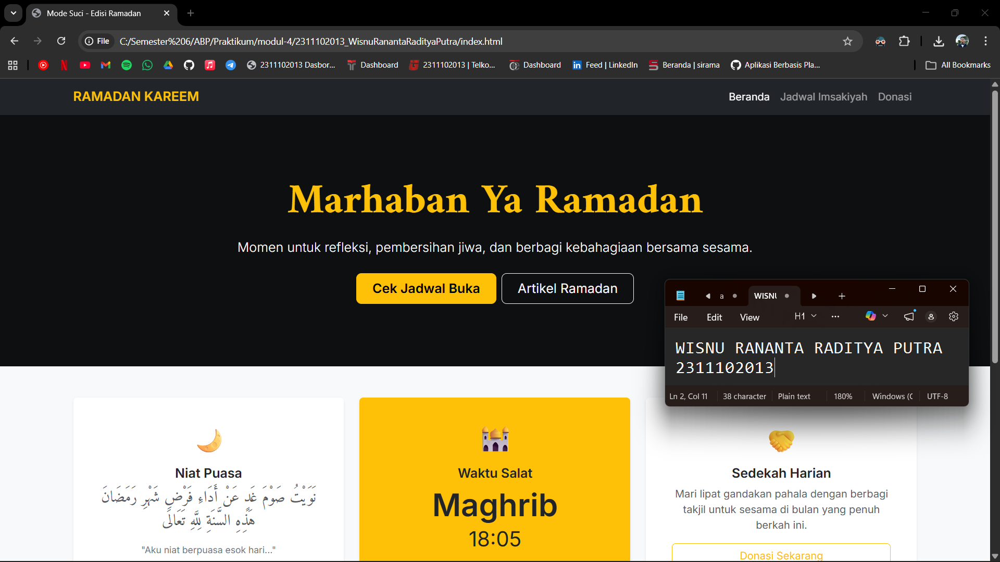

<div align="center">
  <br />
  <h1>LAPORAN PRAKTIKUM <br> APLIKASI BERBASIS PLATFORM </h1>
  <br />
  <h3>MODUL 4 <br> BOOTSTRAP </h3>
  <br />
  
  <br />
  <br />
  <br />
  <h3>Disusun Oleh :</h3>
  <p>
    <strong>Wisnu Rananta Raditya Putra</strong>
    <br>
    <strong>2311102013</strong>
    <br>
    <strong>S1 IF-11-REG05</strong>
  </p>
  <br />
  <h3>Dosen Pengampu :</h3>
  <p>
    <strong>Dedi Agung Prabowo, S.Kom., M.Kom</strong>
  </p>
  <br />
  <br />
  <h4>Asisten Praktikum :</h4>
  <strong>Apri Pandu Wicaksono </strong>
  <br>
  <strong>Hamka Zaenul Ardi</strong>
  <br />
  <h3>LABORATORIUM HIGH PERFORMANCE <br>FAKULTAS INFORMATIKA <br>UNIVERSITAS TELKOM PURWOKERTO <br>2026 </h3>
</div>

<hr>

# Dasar Teori Bootstrap

<p align="justify">
Bootstrap adalah framework front-end open-source yang dikembangkan oleh Mark Otto dan Jacob Thornton di Twitter untuk mempermudah pembuatan tampilan website yang responsif dan konsisten. Bootstrap menyediakan berbagai komponen siap pakai berbasis HTML, CSS, dan JavaScript seperti grid system, tombol, form, navbar, dan card, sehingga pengembang tidak perlu membuat desain dari nol.
</p>

<p align="justify">
Framework ini mengusung konsep responsive design dengan sistem grid 12 kolom serta pendekatan mobile-first, sehingga tampilan dapat menyesuaikan berbagai ukuran layar, mulai dari smartphone hingga desktop. Selain itu, Bootstrap juga menyediakan utility class yang memudahkan pengaturan margin, padding, warna, dan tata letak tanpa perlu banyak menulis CSS tambahan, sehingga proses pengembangan menjadi lebih cepat, efisien, dan terstruktur.
</p>


## Task 4: Mode Suci (Edisi Ramadan)
### Souce code - html
```html
<!DOCTYPE html>
<html lang="id">
<head>
    <meta charset="UTF-8">
    <meta name="viewport" content="width=device-width, initial-scale=1.0">
    <title>Mode Suci - Edisi Ramadan</title>
    <link href="https://cdn.jsdelivr.net/npm/bootstrap@5.3.0/dist/css/bootstrap.min.css" rel="stylesheet">
    <link href="https://fonts.googleapis.com/css2?family=Amiri:wght@400;700&family=Inter:wght@300;400;600&display=swap" rel="stylesheet">
    <style>
        /* Hanya untuk set font family agar nuansa Ramadan terasa */
        body { font-family: 'Inter', sans-serif; background-color: #f8f9fa; }
        .arabic-font { font-family: 'Amiri', serif; }
    </style>
</head>
<body>

    <nav class="navbar navbar-expand-lg navbar-dark bg-dark shadow-sm sticky-top">
        <div class="container">
            <a class="navbar-brand fw-bold text-warning" href="#">RAMADAN KAREEM</a>
            <button class="navbar-toggler" type="button" data-bs-toggle="collapse" data-bs-target="#navbarNav">
                <span class="navbar-toggler-icon"></span>
            </button>
            <div class="collapse navbar-collapse" id="navbarNav">
                <ul class="navbar-nav ms-auto">
                    <li class="nav-item"><a class="nav-link active" href="#">Beranda</a></li>
                    <li class="nav-item"><a class="nav-link" href="#jadwal">Jadwal Imsakiyah</a></li>
                    <li class="nav-item"><a class="nav-link" href="#donasi">Donasi</a></li>
                </ul>
            </div>
        </div>
    </nav>

    <header class="bg-dark text-white py-5 mb-5" style="background: linear-gradient(rgba(0,0,0,0.6), rgba(0,0,0,0.6)), url('https://images.unsplash.com/photo-1542310574-325983226a27?auto=format&fit=crop&q=80&w=1600') center/cover;">
        <div class="container py-5 text-center">
            <h1 class="display-3 fw-bold arabic-font text-warning mb-3">Marhaban Ya Ramadan</h1>
            <p class="lead mb-4">Momen untuk refleksi, pembersihan jiwa, dan berbagi kebahagiaan bersama sesama.</p>
            <div class="d-grid gap-2 d-sm-flex justify-content-sm-center">
                <button type="button" class="btn btn-warning btn-lg px-4 gap-3 fw-bold">Cek Jadwal Buka</button>
                <button type="button" class="btn btn-outline-light btn-lg px-4">Artikel Ramadan</button>
            </div>
        </div>
    </header>

    <div class="container">
        <div class="row g-4 mb-5 text-center">
            <div class="col-md-4">
                <div class="card h-100 border-0 shadow-sm p-4">
                    <div class="card-body">
                        <div class="display-6 text-warning mb-3">🌙</div>
                        <h5 class="card-title fw-bold">Niat Puasa</h5>
                        <p class="card-text text-muted italic arabic-font fs-4">نَوَيْتُ صَوْمَ غَدٍ عَنْ أَدَاءِ فَرْضِ شَهْرِ رَمَضَانَ هَذِهِ السَّنَةِ لِلَّهِ تَعَالَى</p>
                        <p class="small text-secondary">"Aku niat berpuasa esok hari..."</p>
                    </div>
                </div>
            </div>
            <div class="col-md-4">
                <div class="card h-100 border-0 shadow-sm p-4 bg-warning text-dark">
                    <div class="card-body">
                        <div class="display-6 mb-3">🕌</div>
                        <h5 class="card-title fw-bold">Waktu Salat</h5>
                        <p class="display-5 fw-bold mb-0">Maghrib</p>
                        <p class="fs-2 mb-2">18:05</p>
                        <span class="badge bg-dark rounded-pill">Sisa 2 Jam Lagi</span>
                    </div>
                </div>
            </div>
            <div class="col-md-4">
                <div class="card h-100 border-0 shadow-sm p-4">
                    <div class="card-body">
                        <div class="display-6 text-warning mb-3">🤝</div>
                        <h5 class="card-title fw-bold">Sedekah Harian</h5>
                        <p class="card-text text-muted">Mari lipat gandakan pahala dengan berbagi takjil untuk sesama di bulan yang penuh berkah ini.</p>
                        <a href="#" class="btn btn-outline-warning w-100">Donasi Sekarang</a>
                    </div>
                </div>
            </div>
        </div>

        <div id="jadwal" class="mb-5">
            <h3 class="text-center fw-bold mb-4">Jadwal Imsakiyah & Buka Puasa</h3>
            <div class="table-responsive shadow-sm rounded">
                <table class="table table-hover table-white align-middle mb-0">
                    <thead class="table-dark">
                        <tr>
                            <th class="py-3 px-4">Hari ke</th>
                            <th>Tanggal</th>
                            <th>Imsak</th>
                            <th>Subuh</th>
                            <th>Dzuhur</th>
                            <th>Ashar</th>
                            <th class="text-warning">Maghrib</th>
                            <th>Isya</th>
                        </tr>
                    </thead>
                    <tbody>
                        <tr class="table-warning border-warning">
                            <td class="px-4 fw-bold">1 Ramadan</td>
                            <td>1 April 2026</td>
                            <td>04:30</td>
                            <td>04:40</td>
                            <td>12:01</td>
                            <td>15:15</td>
                            <td class="fw-bold">18:05</td>
                            <td>19:15</td>
                        </tr>
                        <tr>
                            <td class="px-4 fw-bold text-muted">2 Ramadan</td>
                            <td>2 April 2026</td>
                            <td>04:30</td>
                            <td>04:40</td>
                            <td>12:01</td>
                            <td>15:16</td>
                            <td class="fw-bold">18:04</td>
                            <td>19:14</td>
                        </tr>
                        </tbody>
                </table>
            </div>
        </div>
    </div>

    <footer class="bg-dark text-white-50 py-5 mt-5 border-top border-warning border-4">
        <div class="container text-center">
            <p class="mb-2 text-white fw-bold">Ramadan Kareem © 2026</p>
            <p class="small mb-0">Dibuat dengan penuh keberkahan menggunakan Bootstrap 5</p>
        </div>
    </footer>

    <script src="https://cdn.jsdelivr.net/npm/bootstrap@5.3.0/dist/dist/js/bootstrap.bundle.min.js"></script>
</body>
</html>
```
### Screenshots Output


# Penjelasan
<p align="justify">
Kode tersebut adalah halaman website bertema Ramadan yang dibuat menggunakan Bootstrap agar tampilan rapi dan responsif. Bagian atas berisi navbar (menu) dan header dengan gambar background serta teks “Marhaban Ya Ramadan” dan tombol aksi. Di bagian tengah terdapat tiga card yang menampilkan niat puasa, waktu salat, dan ajakan sedekah, yang diatur menggunakan sistem grid Bootstrap agar tersusun rapi.
</p>

<p align="justify">
Selanjutnya ada tabel jadwal imsakiyah yang menampilkan waktu salat harian, serta bagian footer di bawah sebagai penutup. Secara keseluruhan, kode ini memanfaatkan class bawaan Bootstrap seperti container, row, card, dan table untuk membuat desain yang menarik tanpa banyak CSS tambahan.
</p>
