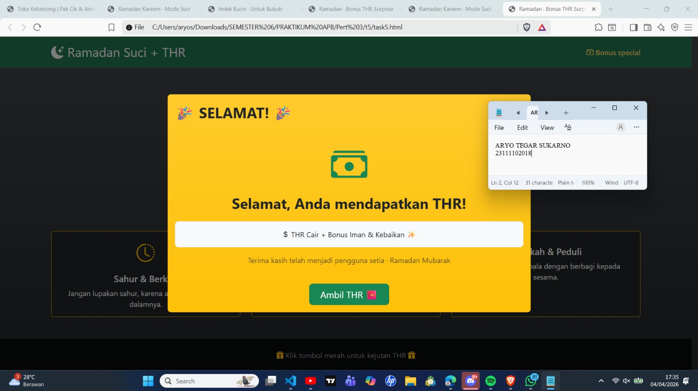

# Modul

   
  <h1>LAPORAN PRAKTIKUM   APLIKASI BERBASIS PLATFORM </h1>
   
  <h3>MODUL 4   CSS </h3>
   
  
   
   
   
  <h3>Disusun Oleh :</h3>
  

    <strong>Aryo Tegar Sukarno</strong>
     
    <strong>2311102018</strong>
     
    <strong>S1 IF-11-REG05</strong>
  

   
  <h3>Dosen Pengampu :</h3>
  

    <strong>Dedi Agung Prabowo, S.Kom., M.Kom</strong>
  

   
   
  <h4>Asisten Praktikum :</h4>
  <strong>Apri Pandu Wicaksono </strong>
   
  <strong>Hamka Zaenul Ardi</strong>
   
  <h3>LABORATORIUM HIGH PERFORMANCE  FAKULTAS INFORMATIKA  UNIVERSITAS TELKOM PURWOKERTO  2026 </h3>

# Dasar Teori

<h2>Dasar Teori</h2>
Halaman web tersebut merupakan website bertema Ramadan yang dibuat menggunakan HTML5 dan framework Bootstrap 5 untuk menghasilkan tampilan modern serta responsif tanpa menggunakan CSS tambahan. Halaman diawali dengan navbar bernuansa islami yang menampilkan identitas Ramadan dan tahun Hijriyah, kemudian dilanjutkan dengan hero section berisi ucapan Ramadan Kareem serta ajakan meningkatkan ibadah. Selanjutnya terdapat tiga kartu informasi yang menyampaikan amalan utama selama Ramadan, yaitu sahur, tadarus Al-Qur’an, dan sedekah. Website juga menampilkan ilustrasi jadwal berbuka puasa dan imsak sebagai panduan waktu ibadah harian. Bagian akhir ditutup dengan footer berisi doa dan pesan religius, sehingga keseluruhan halaman memberikan informasi sekaligus nuansa spiritual Ramadan secara sederhana dan menarik.

# HASIL SS

