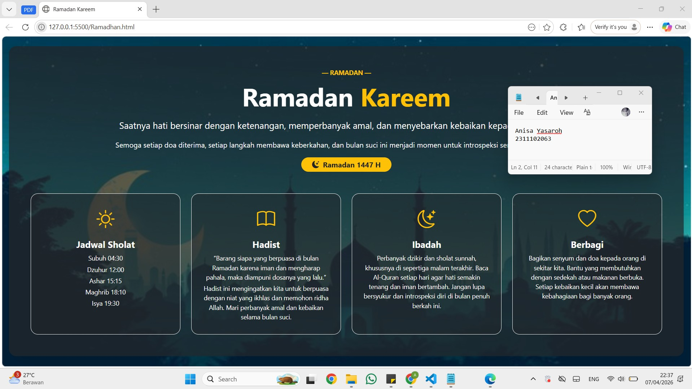

<div align="center">
  <br />
  <h1>LAPORAN PRAKTIKUM <br> APLIKASI BERBASIS PLATFORM </h1>
  <br />
  <h3>MODUL 4 <br> BOOTSTRAP </h3>
  <br />
  
  <br />
  <br />
  <br />
  <h3>Disusun Oleh :</h3>
  <p>
    <strong>Anisa Yasaroh</strong>
    <br>
    <strong>2311102063</strong>
    <br>
    <strong>S1 IF-11-REG05</strong>
  </p>
  <br />
  <h3>Dosen Pengampu :</h3>
  <p>
    <strong>Dedi Agung Prabowo, S.Kom., M.Kom</strong>
  </p>
  <br />
  <br />
  <h4>Asisten Praktikum :</h4>
  <strong>Apri Pandu Wicaksono </strong>
  <br>
  <strong>Hamka Zaenul Ardi</strong>
  <br />
  <h3>LABORATORIUM HIGH PERFORMANCE <br>FAKULTAS INFORMATIKA <br>UNIVERSITAS TELKOM PURWOKERTO <br>2026 </h3>
</div>

<hr>

## Dasar Teori

Bootstrap merupakan framework open-source berbasis HTML, CSS, dan JavaScript yang digunakan untuk mempermudah proses pembuatan tampilan website yang responsif dan mobile-friendly. Framework ini pertama kali dikembangkan oleh tim Twitter pada tahun 2011 dengan tujuan menyatukan standar desain antarmuka agar lebih konsisten dan mudah diterapkan. Bootstrap menyediakan berbagai komponen siap pakai seperti tombol, formulir, navigasi, serta sistem grid layout yang memungkinkan pengembang membuat tampilan web yang rapi dan mampu menyesuaikan ukuran layar secara otomatis pada berbagai perangkat.

Penggunaan Bootstrap membantu mempercepat proses pengembangan website karena developer tidak perlu membangun desain dari nol. Framework ini juga menyediakan komponen interaktif berbasis JavaScript seperti modal, dropdown, dan carousel yang dapat langsung digunakan. Selain itu, Bootstrap memiliki sistem utilitas warna teks yang siap pakai, misalnya class `text-danger` untuk warna merah, `text-primary` untuk warna biru, `text-success` untuk warna hijau, `text-warning` untuk warna kuning, dan `text-dark` untuk warna hitam. Fitur ini membantu pengembang memberikan penekanan visual pada teks tanpa perlu menambahkan CSS secara manual sehingga tampilan website tetap konsisten dan mudah dikelola.

### Penjelasan Bootstrap

Kode HTML pada modul ini digunakan untuk membuat tampilan halaman web bertema Ramadan Kareem menggunakan framework Bootstrap. Tampilan disusun dengan sistem grid Bootstrap serta memanfaatkan berbagai utility class dan komponen.

## Task 4: Mode Suci (Edisi Ramadan)

```html
<!-- 2311102063
Anisa Yasaroh
IF-11-REG05 -->

<!DOCTYPE html>
<html lang="id">

<head>
  <meta charset="UTF-8">
  <title>Ramadan Kareem</title>
  <link href="https://cdn.jsdelivr.net/npm/bootstrap@5.3.2/dist/css/bootstrap.min.css" rel="stylesheet">
  <link href="https://cdn.jsdelivr.net/npm/bootstrap-icons@1.11.3/font/bootstrap-icons.css" rel="stylesheet">
</head>

<body class="min-vh-100 position-relative">

  

  <div
    class="position-relative d-flex flex-column align-items-center justify-content-center min-vh-100 text-center px-3">
    <div class="bg-dark bg-opacity-75 rounded-4 p-5 shadow-lg w-100 w-md-75">

      <p class="text-warning fw-bold text-uppercase small mb-2">— Ramadan —</p>
      <h1 class="display-4 fw-bolder mb-3 text-white">Ramadan <span class="text-warning">Kareem</span></h1>
      <p class="fs-5 mb-3 text-white">
        Saatnya hati bersinar dengan ketenangan, memperbanyak amal, dan menyebarkan kebaikan kepada semua orang.
      </p>
      <p class="fs-6 mb-3 text-white">
        Semoga setiap doa diterima, setiap langkah membawa keberkahan, dan bulan suci ini menjadi momen untuk
        introspeksi serta memperkuat iman.
      </p>

      <div class="mb-4">
        <span class="badge rounded-pill bg-warning text-dark px-4 py-2 fs-6 d-inline-flex align-items-center gap-2">
          <i class="bi bi-moon-stars-fill"></i> Ramadan 1447 H
        </span>
      </div>

      <div class="row g-4 mt-4">
        <div class="col-md-6 col-lg-3">
          <div class="card text-center p-4 shadow-sm bg-dark bg-opacity-50 border border-light rounded-4 h-100">
            <i class="bi bi-sun fs-1 text-warning mb-3"></i>
            <h5 class="fw-bold text-white mb-2">Jadwal Sholat</h5>
            <p class="small text-white mb-1">Subuh 04:30</p>
            <p class="small text-white mb-1">Dzuhur 12:00</p>
            <p class="small text-white mb-1">Ashar 15:15</p>
            <p class="small text-white mb-1">Maghrib 18:10</p>
            <p class="small text-white mb-0">Isya 19:30</p>
          </div>
        </div>
        <div class="col-md-6 col-lg-3">
          <div class="card text-center p-4 shadow-sm bg-dark bg-opacity-50 border border-light rounded-4 h-100">
            <i class="bi bi-book fs-1 text-warning mb-3"></i>
            <h5 class="fw-bold text-white mb-2">Hadist</h5>
            <p class="small text-white mb-1">
              “Barang siapa yang berpuasa di bulan Ramadan karena iman dan mengharap pahala, maka diampuni dosanya yang
              lalu.”
            </p>
            <p class="small text-white mb-1">
              Hadist ini mengingatkan kita untuk berpuasa dengan niat yang ikhlas dan memohon ridha Allah. Mari
              perbanyak amal dan kebaikan selama bulan suci.
            </p>
          </div>
        </div>

        <div class="col-md-6 col-lg-3">
          <div class="card text-center p-4 shadow-sm bg-dark bg-opacity-50 border border-light rounded-4 h-100">
            <i class="bi bi-moon-stars fs-1 text-warning mb-3"></i>
            <h5 class="fw-bold text-white mb-2">Ibadah</h5>
            <p class="small text-white mb-1">Perbanyak dzikir dan sholat sunnah, khususnya di sepertiga malam terakhir.
              Baca Al-Quran setiap hari agar hati semakin tenang dan iman bertambah. Jangan lupa bersyukur dan
              introspeksi diri di bulan penuh berkah ini.</p>
          </div>
        </div>

        <div class="col-md-6 col-lg-3">
          <div class="card text-center p-4 shadow-sm bg-dark bg-opacity-50 border border-light rounded-4 h-100">
            <i class="bi bi-heart fs-1 text-warning mb-3"></i>
            <h5 class="fw-bold text-white mb-2">Berbagi</h5>
            <p class="small text-white mb-1">Bagikan senyum dan doa kepada orang di sekitar kita. Bantu yang membutuhkan
              dengan sedekah atau makanan berbuka. Setiap kebaikan kecil akan membawa kebahagiaan bagi banyak orang.</p>
          </div>
        </div>

      </div>

    </div>
  </div>

  <script src="https://cdn.jsdelivr.net/npm/bootstrap@5.3.2/dist/js/bootstrap.bundle.min.js"></script>
</body>

</html>
```
### Screenshot Output


### Penjelasan Code

Kode HTML pada modul ini membangun halaman web bertema Ramadan Kareem sepenuhnya menggunakan Bootstrap tanpa CSS tambahan. Struktur halaman memanfaatkan grid system Bootstrap untuk membagi konten menjadi dua bagian utama: bagian teks ucapan Ramadan di atas dan empat card informasi di bawah yang menampilkan Jadwal Sholat, Hadist, Ibadah, dan Berbagi. Gambar latar menutupi seluruh layar dengan overlay semi-transparan agar teks dan kartu tetap terbaca dengan jelas. Setiap card menggunakan utility class Bootstrap untuk warna teks `text-white`, `text-warning`, latar belakang `bg-dark`, `bg-opacity-50`, padding, border, dan bayangan `shadow-sm` sehingga tampilan terlihat elegan dan konsisten.

Semua elemen kartu menggunakan class Bootstrap untuk mengatur teks, padding, border, bayangan, dan posisi konten di dalam card. Icon pada setiap card ditambahkan melalui Bootstrap Icons untuk menampilkan simbol visual sesuai tema masing-masing. Layout dan posisi seluruh elemen, termasuk badge Ramadan 1447 H, diatur dengan utility class Bootstrap seperti `d-flex`, `flex-column`, `align-items-center`, dan `justify-content-center` agar konten tetap terpusat dan responsif di berbagai ukuran layar. 