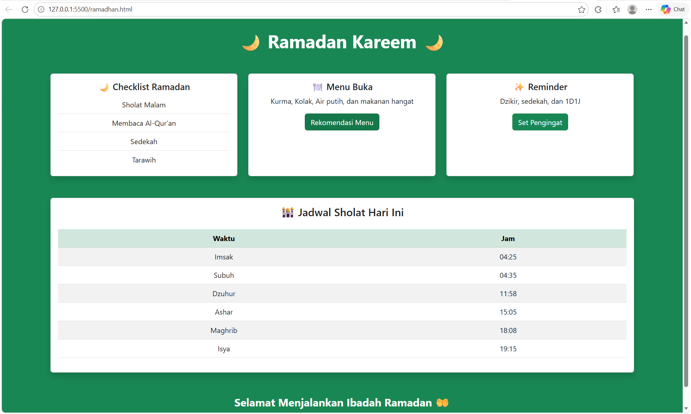

<div align="center">
  <br />
  <h1>LAPORAN PRAKTIKUM <br> APLIKASI BERBASIS PLATFORM </h1>
  <br />
  <h3>MODUL 4 <br> BOOTSTRAP </h3>
  <br />
  
  <br />
  <br />
  <br />
  <h3>Disusun Oleh :</h3>
  <p>
    <strong>Fitri Kusumaningtyas</strong>
    <br>
    <strong>2311102068</strong>
    <br>
    <strong>S1 IF-11-REG05</strong>
  </p>
  <br />
  <h3>Dosen Pengampu :</h3>
  <p>
    <strong>Dedi Agung Prabowo, S.Kom., M.Kom</strong>
  </p>
  <br />
  <br />
  <h4>Asisten Praktikum :</h4>
  <strong>Apri Pandu Wicaksono </strong>
  <br>
  <strong>Hamka Zaenul Ardi</strong>
  <br />
  <h3>LABORATORIUM HIGH PERFORMANCE <br>FAKULTAS INFORMATIKA <br>UNIVERSITAS TELKOM PURWOKERTO <br>2026 </h3>
</div>

<hr>

## 1. Dasar Teori

Bootstrap adalah framework front-end berbasis HTML, CSS, dan JavaScript yang digunakan untuk mempermudah pengembangan tampilan website agar lebih cepat, responsif, dan konsisten. Bootstrap menyediakan berbagai komponen siap pakai seperti grid system, tombol, card, navbar, form, dan utilitas styling tanpa harus menulis CSS dari awal.

Secara teori, Bootstrap bekerja dengan konsep responsive design, yaitu tampilan web dapat menyesuaikan ukuran layar perangkat (desktop, tablet, maupun mobile). Hal ini didukung oleh grid system berbasis 12 kolom yang memungkinkan pengembang mengatur layout halaman secara fleksibel. Selain itu, Bootstrap juga menyediakan utility classes seperti pengaturan warna (bg-success), margin (mt-3), padding (p-4), dan tipografi (fw-bold, fs-3) untuk mempercepat proses styling.

## 2. Source Code

Berikut adalah kode HTML dan CSS untuk membuat kartu ucapan Tahun Baru Imlek.

### Source Code HTML
```html
<!DOCTYPE html>
<!--Fitri Kusumaningtyas-->
<html lang="id">
    <head>
        <meta charset="UTF-8">
        <meta name="viewport" content="width=device-width, initial-scale=1.0">
        <title>Mode Suci Ramadan</title>

        <link href="https://cdn.jsdelivr.net/npm/bootstrap@5.3.0/dist/css/bootstrap.min.css" rel="stylesheet">
    </head>

    <body class="bg-success">

        <div class="container py-5">
            <h1 class="text-center text-white fw-bold mb-5">
                🌙 Ramadan Kareem 🌙
            </h1>

        <div class="row g-4">

        <div class="col-md-4">
            <div class="card shadow h-100">
                <div class="card-body text-center">
                    <h5 class="card-title">🌙 Checklist Ramadan</h5>
                    <ul class="list-group list-group-flush">
                    <li class="list-group-item">Sholat Malam</li>
                    <li class="list-group-item">Membaca Al-Qur'an</li>
                    <li class="list-group-item">Sedekah</li>
                    <li class="list-group-item">Tarawih</li>
                    </ul>
                </div>
            </div>
        </div>

        <div class="col-md-4">
            <div class="card shadow h-100">
                <div class="card-body text-center">
                    <h5 class="card-title">🍽️ Menu Buka</h5>
                    <p class="card-text">
                        Kurma, Kolak, Air putih, dan makanan hangat
                    </p>
                    <button class="btn btn-success">
                    Rekomendasi Menu
                    </button>
                </div>
            </div>
        </div>

        <div class="col-md-4">
            <div class="card shadow h-100">
                <div class="card-body text-center">
                    <h5 class="card-title">✨ Reminder</h5>
                    <p class="card-text">
                    Dzikir, sedekah, dan 1D1J
                    </p>
                    <button class="btn btn-success">
                    Set Pengingat
                    </button>
                </div>
            </div>
        </div>

        </div>

        <div class="card shadow mt-5">
            <div class="card-body">

            <h4 class="text-center mb-4">🕌 Jadwal Sholat Hari Ini</h4>
            <table class="table table-striped text-center">
                <thead class="table-success">
                <tr>
                    <th>Waktu</th>
                    <th>Jam</th>
                </tr>
                </thead>
                <tbody>
                    <tr><td>Imsak</td><td>04:25</td></tr>
                    <tr><td>Subuh</td><td>04:35</td></tr>
                    <tr><td>Dzuhur</td><td>11:58</td></tr>
                    <tr><td>Ashar</td><td>15:05</td></tr>
                    <tr><td>Maghrib</td><td>18:08</td></tr>
                    <tr><td>Isya</td><td>19:15</td></tr>
                </tbody>
            </table>

            </div>
        </div>

        <footer class="text-center text-white mt-5">
        <p class="mb-0 fs-4 fw-bold">Selamat Menjalankan Ibadah Ramadan 🤲</p>
        </footer>

        </div>

    </body>
</html>
```
### Screenshot output


## Penjelasan Code

Kode HTML tema Ramadan dibuat menggunakan framework Bootstrap untuk mempermudah pengaturan tampilan tanpa menulis CSS secara manual. Pada bagian `<head>` ditambahkan link Bootstrap agar seluruh class bawaan dapat digunakan. Bagian `<body>` menggunakan class bg-success bg-gradient untuk memberikan warna latar belakang hijau dengan efek gradasi yang sesuai dengan nuansa Ramadan. Selanjutnya, elemen container digunakan untuk membungkus seluruh konten agar tersusun rapi dan berada di tengah halaman. Judul halaman dibuat menggunakan tag `<h1>` dengan class text-center, text-white, dan fw-bold untuk menampilkan teks di tengah, berwarna putih, serta tebal.

Layout halaman diatur menggunakan sistem grid Bootstrap dengan row dan col-md-4 sehingga konten terbagi menjadi tiga kolom yang responsif. Setiap kolom berisi komponen card yang digunakan untuk menampilkan informasi seperti checklist Ramadan, menu buka puasa, dan reminder. Komponen tambahan seperti list-group digunakan untuk menampilkan daftar kegiatan secara rapi, sedangkan tabel jadwal Ramadan dibuat menggunakan class table dan table-striped agar tampilan lebih terstruktur. Pada bagian bawah halaman ditambahkan footer dengan class text-center, text-white, dan mt-5 untuk menampilkan pesan penutup. Dengan memanfaatkan komponen dan utility class Bootstrap, halaman dapat terlihat menarik, responsif, dan konsisten tanpa menggunakan styling CSS tambahan.