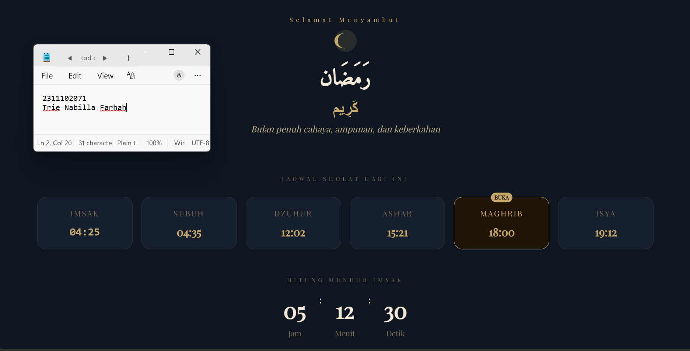

<div align="center">
  <br />
  <h1>LAPORAN PRAKTIKUM <br> APLIKASI BERBASIS PLATFORM </h1>
  <br />
  <h3>MODUL 4 <br> BOOTSTRAP </h3>
  <br />
  
  <br />
  <br />
  <br />
  <h3>Disusun Oleh :</h3>
  <p>
    <strong>Trie Nabilla Farhah</strong>
    <br>
    <strong>2311102071</strong>
    <br>
    <strong>S1 IF-11-REG05</strong>
  </p>
  <br />
  <h3>Dosen Pengampu :</h3>
  <p>
    <strong>Dedi Agung Prabowo, S.Kom., M.Kom</strong>
  </p>
  <br />
  <br />
  <h4>Asisten Praktikum :</h4>
  <strong>Apri Pandu Wicaksono </strong>
  <br>
  <strong>Hamka Zaenul Ardi</strong>
  <br />
  <h3>LABORATORIUM HIGH PERFORMANCE <br>FAKULTAS INFORMATIKA <br>UNIVERSITAS TELKOM PURWOKERTO <br>2026 </h3>
</div>

<hr>

## Dasar Teori

Bootstrap merupakan framework CSS yang bersifat open-source dan digunakan untuk mempercepat pengembangan antarmuka web yang responsif dan konsisten. Bootstrap menyediakan kumpulan komponen siap pakai seperti grid system, tombol, form, navigasi, serta utilities class yang memudahkan pengembang dalam mendesain tampilan tanpa harus menulis CSS dari awal. Framework ini menggunakan pendekatan mobile-first, yaitu desain yang dioptimalkan terlebih dahulu untuk perangkat mobile kemudian disesuaikan ke layar yang lebih besar, sehingga menghasilkan tampilan yang adaptif di berbagai perangkat.

Secara teoritis, Bootstrap dibangun di atas konsep grid system berbasis flexbox atau CSS, yang membagi layout menjadi baris (row) dan kolom (column) untuk mempermudah pengaturan struktur halaman. Selain itu, Bootstrap juga mengandalkan class-based styling, dimana pengembang cukup menambahkan class tertentu pada elemen HTML untuk mendapatkan tampilan yang diinginkan. Dengan adanya komponen dan utilities yang terstandarisasi, Bootstrap mampu meningkatkan efisiensi, konsistensi desain, serta mempermudah proses pengembangan web modern.

### Penjelasan Bootstrap

Pada modul ini, kode HTML digunakan untuk merancang tampilan halaman web bertema Ramadan Kareem dengan bantuan framework Bootstrap. Struktur layout disusun menggunakan sistem grid Bootstrap serta memanfaatkan utility class dan komponen Bootstrap untuk menghasilkan tampilan yang responsif dan terstruktur.

## Task 4: Mode Suci (Edisi Ramadan)

```html
<!-- 2311102071
Trie Nabilla Farhah
IF-11-REG05 -->

<!DOCTYPE html>
<html lang="id">

<head>
    <meta charset="UTF-8">
    <meta name="viewport" content="width=device-width, initial-scale=1.0">

    <link href="https://cdn.jsdelivr.net/npm/bootstrap@5.3.3/dist/css/bootstrap.min.css" rel="stylesheet">
    <link href="https://cdn.jsdelivr.net/npm/bootstrap-icons@1.11.3/font/bootstrap-icons.css" rel="stylesheet">

    <link href="https://fonts.googleapis.com/css2?family=Playfair+Display&family=Amiri&display=swap" rel="stylesheet">
</head>

<body>

    <div class="min-vh-100 d-flex flex-column justify-content-center"
        style="background:#0e1621; font-family:'Playfair Display',serif; color:#f5ead8;">

        <!-- HEADER -->
        <div
            class="d-flex justify-content-between align-items-center px-4 py-3 border-bottom border-secondary border-opacity-25">
            <span style="color:#c4a96a; letter-spacing:4px; font-size:11px;">1446 H</span>
            <span style="color:#c4a96a; font-family:monospace;">--:--:--</span>
            <span style="color:#c4a96a; letter-spacing:4px; font-size:11px;">JAKARTA</span>
        </div>

        <!-- HERO -->
        <div class="text-center py-5">

            <div style="color:#c4a96a; letter-spacing:6px; font-size:11px;">
                Selamat Menyambut
            </div>

            <!-- Moon -->
            <svg width="120" height="60" viewBox="0 0 120 60" class="mb-3">
                <circle cx="60" cy="30" r="20" fill="#c4a96a" opacity="0.15" />
                <path d="M60 16 C48 16 40 22 40 30 C40 38 48 44 60 44 
        C52 44 46 38 46 30 C46 22 52 16 60 16Z" fill="#c4a96a" />
            </svg>

            <h1 class="fw-bold" style="font-family:'Amiri',serif;">رَمَضَان</h1>
            <h2 class="fw-bold" style="color:#c4a96a;">كَرِيم</h2>

            <p style="color:#b8a88a;" class="fst-italic">
                Bulan penuh cahaya, ampunan, dan keberkahan
            </p>

        </div>

        <!-- JADWAL SHOLAT -->
        <div class="container pb-5">

            <div class="text-center mb-4">
                <span style="font-size:10px; letter-spacing:5px; color:#7a6a55;">
                    JADWAL SHOLAT HARI INI
                </span>
            </div>

            <div class="row g-3 justify-content-center">

                <!-- ITEM -->
                <div class="col-6 col-md-2">
                    <div class="p-3 rounded-4 text-center shadow-sm"
                        style="background:#151f2e; border:1px solid #c4a96a22;">
                        <small style="letter-spacing:2px; color:#7a6a55;">IMSAK</small>
                        <div class="fw-bold mt-2" style="color:#c4a96a; font-size:20px; font-family:monospace;">04:25
                        </div>
                    </div>
                </div>

                <div class="col-6 col-md-2">
                    <div class="p-3 rounded-4 text-center shadow-sm"
                        style="background:#151f2e; border:1px solid #c4a96a22;">
                        <small style="letter-spacing:2px; color:#7a6a55;">SUBUH</small>
                        <div class="fw-bold mt-2" style="color:#c4a96a; font-size:20px;">04:35</div>
                    </div>
                </div>

                <div class="col-6 col-md-2">
                    <div class="p-3 rounded-4 text-center shadow-sm"
                        style="background:#151f2e; border:1px solid #c4a96a22;">
                        <small style="letter-spacing:2px; color:#7a6a55;">DZUHUR</small>
                        <div class="fw-bold mt-2" style="color:#c4a96a; font-size:20px;">12:02</div>
                    </div>
                </div>

                <div class="col-6 col-md-2">
                    <div class="p-3 rounded-4 text-center shadow-sm"
                        style="background:#151f2e; border:1px solid #c4a96a22;">
                        <small style="letter-spacing:2px; color:#7a6a55;">ASHAR</small>
                        <div class="fw-bold mt-2" style="color:#c4a96a; font-size:20px;">15:21</div>
                    </div>
                </div>

                <div class="col-6 col-md-2">
                    <div class="p-3 rounded-4 text-center shadow-sm position-relative"
                        style="background:#1e1508; border:1px solid #c4a96a;">
                        <span class="position-absolute top-0 start-50 translate-middle badge rounded-pill"
                            style="background:#c4a96a; color:#1e1508; font-size:10px;">BUKA</span>
                        <small style="letter-spacing:2px; color:#c4a96a;">MAGHRIB</small>
                        <div class="fw-bold mt-2" style="color:#c4a96a; font-size:20px;">18:00</div>
                    </div>
                </div>

                <div class="col-6 col-md-2">
                    <div class="p-3 rounded-4 text-center shadow-sm"
                        style="background:#151f2e; border:1px solid #c4a96a22;">
                        <small style="letter-spacing:2px; color:#7a6a55;">ISYA</small>
                        <div class="fw-bold mt-2" style="color:#c4a96a; font-size:20px;">19:12</div>
                    </div>
                </div>

            </div>

        </div>

        <!-- COUNTDOWN STATIC -->
        <div class="container pb-5 text-center">

            <div style="letter-spacing:5px; font-size:10px; color:#7a6a55;" class="mb-3">
                HITUNG MUNDUR IMSAK
            </div>

            <div class="d-flex justify-content-center gap-4">

                <div>
                    <div class="fw-bold" style="font-size:40px;">05</div>
                    <small style="color:#7a6a55;">Jam</small>
                </div>

                <div>:</div>

                <div>
                    <div class="fw-bold" style="font-size:40px;">12</div>
                    <small style="color:#7a6a55;">Menit</small>
                </div>

                <div>:</div>

                <div>
                    <div class="fw-bold" style="font-size:40px;">30</div>
                    <small style="color:#7a6a55;">Detik</small>
                </div>

            </div>

        </div>

    </div>

</body>

</html>
```
### Screenshot Output


### Penjelasan Code

Kode HTML tersebut digunakan untuk membangun tampilan website bertema Ramadan Kareem dengan memanfaatkan framework Bootstrap tanpa menggunakan CSS tambahan. Pada bagian head, Bootstrap dihubungkan melalui CDN agar dapat langsung menggunakan berbagai class bawaan. Struktur utama halaman menggunakan container-fluid, d-flex, dan flex-column untuk membuat layout full layar yang tersusun secara vertikal. Bagian header menampilkan informasi tahun Hijriyah, jam, dan lokasi dengan bantuan d-flex justify-content-between agar tersusun rapi. Selanjutnya, bagian hero menampilkan judul utama “Ramadan Kareem” dengan tampilan besar dan terpusat menggunakan class seperti text-center, display, dan fw-bold.

Bagian konten terdiri dari jadwal sholat, countdown, serta beberapa card informasi seperti amalan, doa, dan tracker ibadah. Jadwal sholat dibuat menggunakan grid system Bootstrap (row dan col) sehingga responsif di berbagai ukuran layar. Komponen seperti card, badge, dan button digunakan untuk mempercantik tampilan tanpa perlu CSS tambahan. Selain itu, JavaScript digunakan untuk menambahkan fitur interaktif seperti jam real-time, hitung mundur imsak, dan tracker ibadah yang bisa diklik. Secara keseluruhan, kode ini memanfaatkan keunggulan Bootstrap dalam membuat tampilan yang rapi, responsif, dan efisien. 