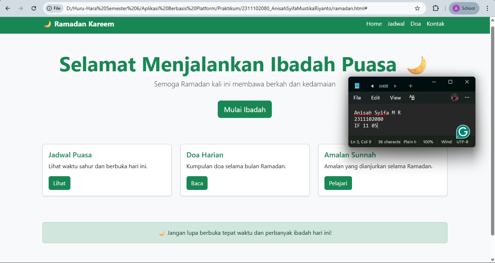

<div align="center">
  <br />
  <h1>LAPORAN PRAKTIKUM <br> APLIKASI BERBASIS PLATFORM </h1>
  <br />
  <h3>MODUL 4 <br> BOOTSTRAP </h3>
  <br />
  
  <br />
  <br />
  <br />
  <h3>Disusun Oleh :</h3>
  <p>
    <strong>Anisah Syifa Mustika Riyanto</strong>
    <br>
    <strong>2311102080</strong>
    <br>
    <strong>S1 IF-11-REG05</strong>
  </p>
  <br />
  <h3>Dosen Pengampu :</h3>
  <p>
    <strong>Dedi Agung Prabowo, S.Kom., M.Kom</strong>
  </p>
  <br />
  <br />
  <h4>Asisten Praktikum :</h4>
  <strong>Apri Pandu Wicaksono </strong>
  <br>
  <strong>Hamka Zaenul Ardi</strong>
  <br />
  <h3>LABORATORIUM HIGH PERFORMANCE <br>FAKULTAS INFORMATIKA <br>UNIVERSITAS TELKOM PURWOKERTO <br>2026</h3>
</div>

<hr>

### Dasar Teori

Bootstrap merupakan framework front-end berbasis HTML, CSS, dan JavaScript yang digunakan untuk mempermudah pengembangan tampilan website agar lebih responsif dan modern. Framework ini menyediakan berbagai komponen siap pakai seperti navbar, button, card, grid system, dan lain-lain yang dapat langsung digunakan tanpa perlu menulis CSS dari awal. Dengan menggunakan Bootstrap, pengembang dapat mengatur tata letak halaman secara fleksibel melalui sistem grid yang berbasis baris (row) dan kolom (column), sehingga tampilan dapat menyesuaikan berbagai ukuran layar seperti desktop, tablet, maupun smartphone. Selain itu, Bootstrap juga memiliki banyak class utility yang memungkinkan pengaturan warna, spacing, tipografi, dan elemen visual lainnya secara cepat hanya dengan menambahkan class tertentu pada elemen HTML. Hal ini membuat proses pengembangan menjadi lebih efisien, konsisten, dan mudah dipelajari, terutama bagi pemula dalam pengembangan web.

### Tugas 4 - Mode Suci (Edisi Ramadan)

#### Source Code

```
<!DOCTYPE html>
<html lang="id">
<head>
  <meta charset="UTF-8">
  <meta name="viewport" content="width=device-width, initial-scale=1">
  <title>Mode Suci - Ramadan</title>

  <!-- Bootstrap CSS -->
  <link href="https://cdn.jsdelivr.net/npm/bootstrap@5.3.3/dist/css/bootstrap.min.css" rel="stylesheet">
</head>
<body class="bg-light text-dark">

  <!-- Navbar -->
  <nav class="navbar navbar-expand-lg navbar-success bg-success">
    <div class="container">
      <a class="navbar-brand fw-bold text-white" href="#">🌙 Ramadan Kareem</a>
      <button class="navbar-toggler" type="button" data-bs-toggle="collapse" data-bs-target="#navbarNav">
        <span class="navbar-toggler-icon"></span>
      </button>
      <div class="collapse navbar-collapse" id="navbarNav">
        <ul class="navbar-nav ms-auto">
          <li class="nav-item"><a class="nav-link text-white active" href="#">Home</a></li>
          <li class="nav-item"><a class="nav-link text-white" href="#">Jadwal</a></li>
          <li class="nav-item"><a class="nav-link text-white" href="#">Doa</a></li>
          <li class="nav-item"><a class="nav-link text-white" href="#">Kontak</a></li>
        </ul>
      </div>
    </div>
  </nav>

  <!-- Hero Section -->
  <div class="container text-center py-5">
    <h1 class="display-4 fw-bold text-success">Selamat Menjalankan Ibadah Puasa 🌙</h1>
    <p class="lead">Semoga Ramadan kali ini membawa berkah dan kedamaian</p>
    <button class="btn btn-success btn-lg mt-3">Mulai Ibadah</button>
  </div>

  <!-- Card Section -->
  <div class="container py-4">
    <div class="row g-4">

      <div class="col-md-4">
        <div class="card h-100 shadow-sm">
          <div class="card-body">
            <h5 class="card-title text-success">Jadwal Puasa</h5>
            <p class="card-text">Lihat waktu sahur dan berbuka hari ini.</p>
            <button class="btn btn-success">Lihat</button>
          </div>
        </div>
      </div>

      <div class="col-md-4">
        <div class="card h-100 shadow-sm">
          <div class="card-body">
            <h5 class="card-title text-success">Doa Harian</h5>
            <p class="card-text">Kumpulan doa selama bulan Ramadan.</p>
            <button class="btn btn-success">Baca</button>
          </div>
        </div>
      </div>

      <div class="col-md-4">
        <div class="card h-100 shadow-sm">
          <div class="card-body">
            <h5 class="card-title text-success">Amalan Sunnah</h5>
            <p class="card-text">Amalan yang dianjurkan selama Ramadan.</p>
            <button class="btn btn-success">Pelajari</button>
          </div>
        </div>
      </div>

    </div>
  </div>

  <!-- Info -->
  <div class="container text-center py-5">
    <div class="alert alert-success">
      🌙 Jangan lupa berbuka tepat waktu dan perbanyak ibadah hari ini!
    </div>
  </div>

  <!-- Footer -->
  <footer class="bg-success text-center text-white py-3">
    <p class="mb-0">© 2026 Ramadan Web | Dibuat dengan Bootstrap</p>
  </footer>

  <!-- Bootstrap JS -->
  <script src="https://cdn.jsdelivr.net/npm/bootstrap@5.3.3/dist/js/bootstrap.bundle.min.js"></script>

</body>
</html>

```

### Hasil Output



### Deskripsi Kode

```
Halaman web bertema Ramadan ini dibangun menggunakan framework Bootstrap dengan memanfaatkan class bawaan tanpa menggunakan CSS tambahan. Struktur dimulai dari bagian <head> yang menghubungkan Bootstrap melalui CDN sehingga semua komponen dan styling dapat langsung digunakan. Pada bagian <body>, digunakan class bg-light dan text-dark untuk memberikan tampilan latar belakang terang dengan teks yang kontras agar mudah dibaca. Selanjutnya terdapat komponen navbar yang menggunakan class navbar, navbar-expand-lg, dan bg-success untuk membuat navigasi responsif dengan warna hijau sebagai identitas tema Ramadan. Bagian hero menampilkan judul utama menggunakan class seperti display-4, fw-bold, dan text-success untuk memberikan penekanan visual, serta tombol dengan class btn btn-success sebagai call-to-action.

Pada bagian konten utama, digunakan sistem grid Bootstrap dengan row dan col-md-4 untuk membagi halaman menjadi tiga kolom yang responsif. Masing-masing kolom berisi card yang dibuat menggunakan class card dan card-body, yang menampilkan informasi seperti jadwal puasa, doa harian, dan amalan sunnah. Elemen tambahan seperti shadow-sm memberikan efek bayangan agar tampilan lebih menarik. Selanjutnya terdapat komponen alert dengan class alert alert-success yang berfungsi sebagai pengingat bagi pengguna. Terakhir, bagian footer menggunakan bg-success dan text-white untuk menjaga konsistensi warna dengan tema utama. Secara keseluruhan, halaman ini memanfaatkan berbagai komponen dan utility class dari Bootstrap untuk menghasilkan tampilan yang rapi, responsif, dan menarik tanpa perlu menambahkan styling manual.
```
