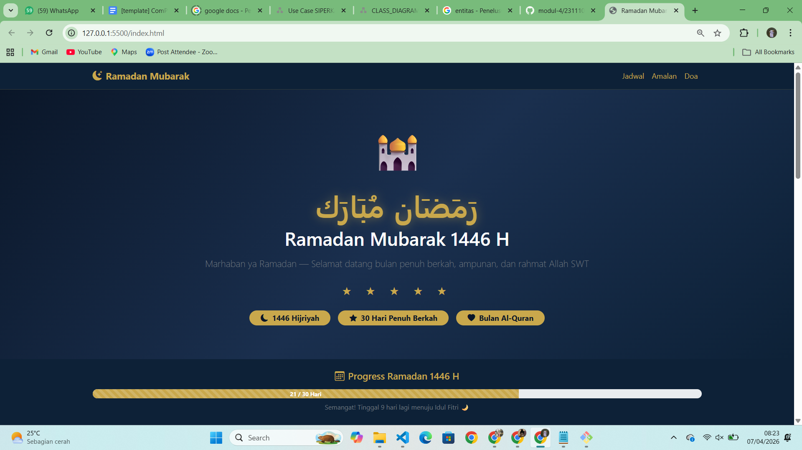

<div align="center">
  <br />
  <h1>LAPORAN PRAKTIKUM <br> APLIKASI BERBASIS PLATFORM </h1>
  <br />
  <h3>MODUL 4 <br> Bootstrap </h3>
  <br />
  
  <br />
  <br />
  <br />
  <h3>Disusun Oleh :</h3>
  <p>
    <strong>Ahmad Tegar Kahfi Asyngarinanto</strong>
    <br>
    <strong>2311102083</strong>
    <br>
    <strong>S1 IF-11-REG05</strong>
  </p>
  <br />
  <h3>Dosen Pengampu :</h3>
  <p>
    <strong>Dedi Agung Prabowo, S.Kom., M.Kom</strong>
  </p>
  <br />
  <br />
  <h4>Asisten Praktikum :</h4>
  <strong>Apri Pandu Wicaksono</strong>
  <br>
  <strong>Hamka Zaenul Ardi</strong>
  <br />
  <h3>LABORATORIUM HIGH PERFORMANCE <br>FAKULTAS INFORMATIKA <br>UNIVERSITAS TELKOM PURWOKERTO <br>2026 </h3>
</div>

<hr>

# Dasar Teori

## 1. Bootstrap

Bootstrap adalah framework CSS open-source yang paling banyak digunakan untuk membangun tampilan web yang responsif dan modern. Dengan Bootstrap, kita tidak perlu menulis CSS dari nol karena sudah tersedia class-class siap pakai yang tinggal diterapkan langsung ke elemen HTML.

Bootstrap pertama kali dikembangkan oleh Twitter pada tahun 2011 dan sekarang sudah masuk versi 5. Pada versi 5, Bootstrap tidak lagi bergantung pada jQuery sehingga lebih ringan dan cepat.

---

## 2. Cara Menggunakan Bootstrap

Bootstrap bisa digunakan dengan dua cara:

- **CDN** — Menghubungkan langsung via link dari internet, cara paling mudah dan tidak perlu install apapun.
- **Download** — Mengunduh file Bootstrap lalu menyimpannya secara lokal.

Pada praktikum ini digunakan metode **CDN**:

```html
<!-- CSS Bootstrap -->
<link href="https://cdn.jsdelivr.net/npm/bootstrap@5.3.3/dist/css/bootstrap.min.css" rel="stylesheet"/>

<!-- JS Bootstrap (untuk komponen interaktif seperti navbar) -->
<script src="https://cdn.jsdelivr.net/npm/bootstrap@5.3.3/dist/js/bootstrap.bundle.min.js"></script>
```

---

## 3. Grid System

Salah satu fitur utama Bootstrap adalah sistem grid 12 kolom yang memudahkan penataan layout halaman. Grid Bootstrap bekerja dengan class `row` dan `col`.

```html
<div class="row">
  <div class="col-md-6">Kolom kiri</div>
  <div class="col-md-6">Kolom kanan</div>
</div>
```

Breakpoint yang tersedia:

| Class | Breakpoint | Lebar Layar |
|-------|-----------|-------------|
| `col-` | xs | < 576px |
| `col-sm-` | Small | ≥ 576px |
| `col-md-` | Medium | ≥ 768px |
| `col-lg-` | Large | ≥ 992px |
| `col-xl-` | Extra large | ≥ 1200px |

---

## 4. Komponen Bootstrap yang Digunakan

### Navbar
Komponen navigasi responsif yang otomatis berubah menjadi hamburger menu di layar kecil.

```html
<nav class="navbar navbar-expand-lg navbar-dark bg-dark">
  <div class="container">
    <a class="navbar-brand" href="#">Brand</a>
  </div>
</nav>
```

### Card
Komponen kotak konten yang fleksibel dengan berbagai variasi tampilan.

```html
<div class="card">
  <div class="card-body">
    <h5 class="card-title">Judul</h5>
    <p class="card-text">Isi konten.</p>
  </div>
</div>
```

### Badge
Label kecil untuk menampilkan status atau kategori.

```html
<span class="badge bg-primary">Wajib</span>
```

### Table
Tabel dengan berbagai class untuk tampilan yang lebih menarik.

```html
<table class="table table-dark table-hover table-bordered">
  ...
</table>
```

### Progress Bar
Komponen untuk menampilkan progress dalam bentuk bar.

```html
<div class="progress">
  <div class="progress-bar" style="width: 70%">70%</div>
</div>
```

### Alert
Kotak pesan untuk menampilkan informasi atau notifikasi.

```html
<div class="alert alert-warning" role="alert">
  Pesan penting di sini.
</div>
```

---

## 5. Utility Classes

Bootstrap menyediakan banyak utility class untuk styling cepat tanpa perlu menulis CSS:

- `text-center`, `text-start`, `text-end` — Perataan teks
- `fw-bold`, `fw-semibold` — Ketebalan font
- `p-3`, `px-4`, `py-2` — Padding
- `m-3`, `mx-auto`, `mb-4` — Margin
- `d-flex`, `justify-content-center`, `align-items-center` — Flexbox
- `shadow`, `rounded`, `rounded-4` — Efek visual
- `gap-3`, `g-4` — Jarak antar elemen
- `fs-1` hingga `fs-6` — Ukuran font

---

# Tugas 4 — Mode Suci (Edisi Ramadan)

## Code

```html
<!DOCTYPE html>
<html lang="id">
<head>
  <meta charset="UTF-8"/>
  <meta name="viewport" content="width=device-width, initial-scale=1.0"/>
  <title>Ramadan Mubarak</title>
  <link href="https://cdn.jsdelivr.net/npm/bootstrap@5.3.3/dist/css/bootstrap.min.css" rel="stylesheet"/>
  <link href="https://cdn.jsdelivr.net/npm/bootstrap-icons@1.11.3/font/bootstrap-icons.css" rel="stylesheet"/>
  <style>
    body { background-color: #0a1628; }
    .hero-section { background: linear-gradient(135deg, #0a1628 0%, #1a2f4e 50%, #0d2137 100%); }
    .gold { color: #c9a84c; }
    .card-ramadan { background: linear-gradient(135deg, #1a2f4e, #0d2137); border: 1px solid #c9a84c33; }
    .badge-gold { background-color: #c9a84c; color: #0a1628; }
    .progress-ramadan .progress-bar { background-color: #c9a84c; }
    .glow-text { text-shadow: 0 0 20px rgba(201, 168, 76, 0.5); }
  </style>
</head>
<body class="text-white">
  <!-- Lihat file index.html untuk kode lengkap -->
</body>
</html>
```

> Kode lengkap tersedia di file `index.html`

## Output


