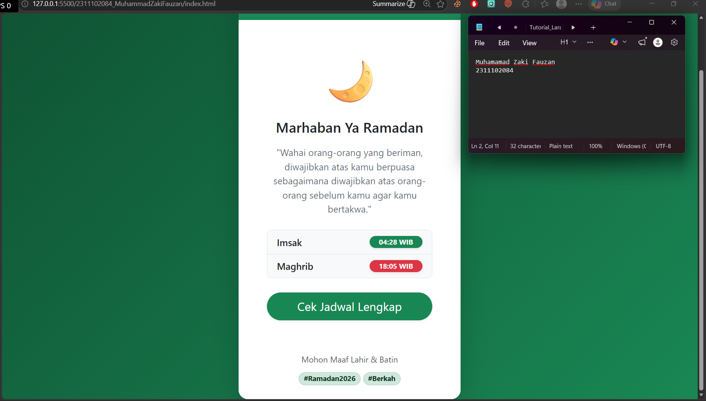

<div align="center">
  <br />
  <h1>LAPORAN PRAKTIKUM <br> APLIKASI BERBASIS PLATFORM </h1>
  <br />
  <h3>MODUL 4 <br> Bootstrap </h3>
  <br />
  
  <br />
  <br />
  <br />
  <h3>Disusun Oleh :</h3>
  <p>
    <strong>Muhammad Zaki Fauzan</strong>
    <br>
    <strong>2311102084</strong>
    <br>
    <strong>S1 IF-11-REG05</strong>
  </p>
  <br />
  <h3>Dosen Pengampu :</h3>
  <p>
    <strong>Dedi Agung Prabowo, S.Kom., M.Kom</strong>
  </p>
  <br />
  <br />
  <h4>Asisten Praktikum :</h4>
  <strong>Apri Pandu Wicaksono </strong>
  <br>
  <strong>Hamka Zaenul Ardi</strong>
  <br />
  <h3>LABORATORIUM HIGH PERFORMANCE <br>FAKULTAS INFORMATIKA <br>UNIVERSITAS TELKOM PURWOKERTO <br>2026 </h3>
</div>

<hr>

# Dasar Teori Bootstrap

## Pengertian Bootstrap
Implementasi Framework Bootstrap dalam pengembangan antarmuka web merupakan sebuah strategi efisiensi yang memanfaatkan ekosistem komponen siap pakai untuk menghasilkan desain yang responsif dan konsisten secara instan. Dengan mengandalkan sistem Grid 12 Kolom dan arsitektur mobile-first, Bootstrap mengeliminasi kebutuhan untuk menulis ribuan baris kode CSS manual, sehingga pengembang dapat berfokus pada logika fungsional tanpa mengorbankan estetika visual. Penggunaan utility classes pada framework ini tidak hanya mempercepat proses styling, tetapi juga menjamin standarisasi elemen UI seperti navbar, card, dan button agar tetap optimal saat diakses melalui berbagai perangkat dan peramban.

## Contoh Implementasi
```html
<button class="btn btn-primary">Klik Saya</button>
```

### Source code - html
```html
<!DOCTYPE html>
<html lang="id">
<head>
    <meta charset="UTF-8">
    <meta name="viewport" content="width=device-width, initial-scale=1.0">
    <title>Ramadan Kareem - Mode Suci</title>
    <link href="https://cdn.jsdelivr.net/npm/bootstrap@5.3.0/dist/css/bootstrap.min.css" rel="stylesheet">
    <style>
        body {
            background: linear-gradient(135deg, #0f5132 0%, #198754 100%);
            min-height: 100vh;
        }
    </style>
</head>
<body class="d-flex align-items-center justify-content-center">

    <div class="container">
        <div class="row justify-content-center">
            <div class="col-md-6 col-lg-5">
                
                <div class="card border-0 shadow-lg rounded-4 overflow-hidden">
                    
                    <div class="card-header bg-success bg-gradient text-white text-center py-4 border-0">
                        <h2 class="fw-bold mb-0">Ramadan Kareem</h2>
                        <small class="text-white-50 text-uppercase tracking-widest">1447 Hijriah</small>
                    </div>

                    <div class="card-body p-5 text-center">
                        <div class="mb-4">
                            <span class="display-1">🌙</span>
                        </div>
                        
                        <h4 class="card-title fw-semibold text-dark mb-3">Marhaban Ya Ramadan</h4>
                        <p class="card-text text-secondary mb-4">
                            "Wahai orang-orang yang beriman, diwajibkan atas kamu berpuasa sebagaimana diwajibkan atas orang-orang sebelum kamu agar kamu bertakwa."
                        </p>

                        <div class="list-group list-group-flush mb-4 rounded-3 border">
                            <div class="list-group-item d-flex justify-content-between align-items-center bg-light">
                                <span class="fw-medium">Imsak</span>
                                <span class="badge bg-success rounded-pill shadow-sm px-3">04:28 WIB</span>
                            </div>
                            <div class="list-group-item d-flex justify-content-between align-items-center bg-light">
                                <span class="fw-medium">Maghrib</span>
                                <span class="badge bg-danger rounded-pill shadow-sm px-3">18:05 WIB</span>
                            </div>
                        </div>

                        <div class="d-grid gap-2">
                            <button class="btn btn-success btn-lg rounded-pill shadow-sm py-2">
                                Cek Jadwal Lengkap
                            </button>
                        </div>
                    </div>

                    <div class="card-footer bg-white border-0 text-center pb-4">
                        <p class="small text-muted mb-0">Mohon Maaf Lahir & Batin</p>
                        <div class="mt-2">
                            <span class="badge text-success-emphasis bg-success-subtle border border-success-subtle rounded-pill">#Ramadan2026</span>
                            <span class="badge text-success-emphasis bg-success-subtle border border-success-subtle rounded-pill">#Berkah</span>
                        </div>
                    </div>
                </div>

            </div>
        </div>
    </div>

    <script src="https://cdn.jsdelivr.net/npm/bootstrap@5.3.0/dist/js/bootstrap.bundle.min.js"></script>
</body>
</html>
```

Output:


### Penjelasan
Halaman ini dirancang menggunakan Bootstrap 5 dengan memanfaatkan sistem Grid (container, row, col) untuk menciptakan tata letak yang responsif secara otomatis di berbagai ukuran perangkat. Penggunaan utility classes seperti card untuk kontainer utama, list-group untuk penyajian jadwal yang rapi, serta efek visual shadow dan rounded, memungkinkan pembuatan antarmuka yang modern dan estetis tanpa perlu menulis banyak kode CSS kustom. Pendekatan ini menonjolkan efisiensi framework dalam menjaga konsistensi desain serta mempercepat proses pengembangan front-end.