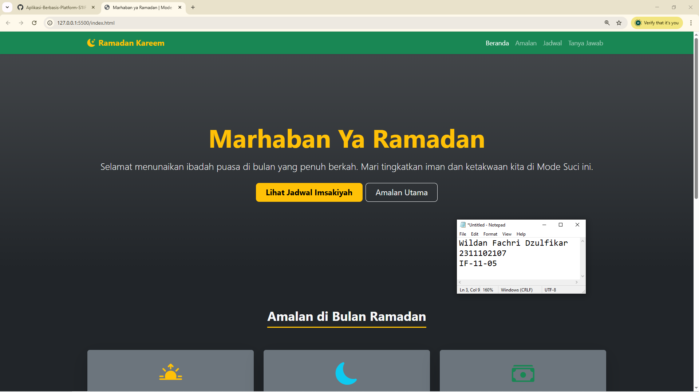

<div align="center">
  <br />
  <h1>LAPORAN PRAKTIKUM <br> APLIKASI BERBASIS PLATFORM </h1>
  <br />
  <h3>MODUL 4 <br> Bootstrap </h3>
  <br />
  
  <br />
  <br />
  <br />
  <h3>Disusun Oleh :</h3>
  <p>
    <strong>Wildan Fachri Dzulfikar</strong>
    <br>
    <strong>2311102107</strong>
    <br>
    <strong>S1 IF-11-REG05</strong>
  </p>
  <br />
  <h3>Dosen Pengampu :</h3>
  <p>
    <strong>Dedi Agung Prabowo, S.Kom., M.Kom</strong>
  </p>
  <br />
  <br />
  <h4>Asisten Praktikum :</h4>
  <strong>Apri Pandu Wicaksono </strong>
  <br>
  <strong>Hamka Zaenul Ardi</strong>
  <br />
  <h3>LABORATORIUM HIGH PERFORMANCE <br>FAKULTAS INFORMATIKA <br>UNIVERSITAS TELKOM PURWOKERTO <br>2026 </h3>
</div>

<hr>

# Dasar Teori Bootstrap

## 1. Pengertian Bootstrap
Bootstrap adalah kerangka kerja (framework) open-source berbasis CSS, HTML, dan JavaScript yang dikembangkan oleh tim Twitter. Tujuan utamanya adalah untuk mempermudah dan mempercepat pengembangan web yang responsif serta mengutamakan tampilan mobile (mobile-first).

## 2. Fitur Utama Bootstrap
*   **Responsive Grid System**: Memungkinkan pembuatan layout yang fleksibel dan adaptif terhadap berbagai ukuran layar.
*   **Pre-styled Components**: Menyediakan ribuan komponen UI seperti Button, Navbar, Card, Modal, dan Form yang siap pakai.
*   **Utility Classes**: Kumpulan class untuk mengatur margin, padding, warna, tipografi, dan perataan secara instan tanpa menulis CSS manual.
*   **JavaScript Plugins**: Integrasi fungsionalitas interaktif seperti drop-down, carousel, dan accordion menggunakan library Popper.js dan jQuery (pada versi lama) atau Vanilla JS (pada versi terbaru).

## 3. Sistem Grid Bootstrap
Sistem grid Bootstrap menggunakan flexbox dan memiliki struktur 12 kolom per baris. Struktur dasarnya terdiri dari:
1.  **Container**: Pembungkus utama untuk menyelaraskan konten (`.container` atau `.container-fluid`).
2.  **Row**: Pembungkus horizontal untuk kolom (`.row`).
3.  **Column**: Unit terkecil dalam baris yang menentukan lebar elemen (`.col-*`).

Bootstrap menggunakan **Breakpoints** untuk menentukan kapan layout harus berubah:
- **xs**: < 576px
- **sm**: ≥ 576px
- **md**: ≥ 768px
- **lg**: ≥ 992px
- **xl**: ≥ 1200px
- **xxl**: ≥ 1400px

## 4. Utility Classes & Components
Beberapa utility dan komponen penting yang sering digunakan:
*   **Spacing**: `m-*` (margin), `p-*` (padding) dengan skala 1-5.
*   **Colors**: `text-primary`, `bg-success`, `text-warning`, dll.
*   **Flexbox**: `d-flex`, `justify-content-center`, `align-items-center`.
*   **Cards**: `.card` untuk membungkus konten dalam satu kotak yang rapi.
*   **Accordion**: `.accordion` untuk menampilkan konten yang dapat di-expand/collapse.


### Source code - html
```html
<!DOCTYPE html>
<html lang="id">
<head>
    <meta charset="UTF-8">
    <meta name="viewport" content="width=device-width, initial-scale=1.0">
    <title>Marhaban ya Ramadan | Mode Suci</title>
    <!-- Bootstrap CSS -->
    <link href="https://cdn.jsdelivr.net/npm/bootstrap@5.3.3/dist/css/bootstrap.min.css" rel="stylesheet">
    <link rel="stylesheet" href="https://cdn.jsdelivr.net/npm/bootstrap-icons@1.11.3/font/bootstrap-icons.min.css">
    <style>
        /* Sesuai instruksi: Tidak ada custom CSS yang mendefinisikan style visual utama */
        /* Hanya memastikan image cover hero terlihat bagus menggunakan bootstrap utility jika memungkinkan */
    </style>
</head>
<body class="bg-dark text-light">

    <!-- Navbar -->
    <nav class="navbar navbar-expand-lg navbar-dark bg-success sticky-top shadow-sm">
        <div class="container">
            <a class="navbar-brand fw-bold text-warning" href="#">
                <i class="bi bi-moon-stars-fill me-2"></i>Ramadan Kareem
            </a>
            <button class="navbar-toggler" type="button" data-bs-toggle="collapse" data-bs-target="#navbarNav">
                <span class="navbar-toggler-icon"></span>
            </button>
            <div class="collapse navbar-collapse" id="navbarNav">
                <ul class="navbar-nav ms-auto">
                    <li class="nav-item"><a class="nav-link active" href="#hero">Beranda</a></li>
                    <li class="nav-item"><a class="nav-link" href="#ibadah">Amalan</a></li>
                    <li class="nav-item"><a class="nav-link" href="#jadwal">Jadwal</a></li>
                    <li class="nav-item"><a class="nav-link" href="#faq">Tanya Jawab</a></li>
                </ul>
            </div>
        </div>
    </nav>

    <!-- Hero Section -->
    <header id="hero" class="py-5 text-center bg-gradient mb-5" style="background: linear-gradient(rgba(0,0,0,0.6), rgba(0,0,0,0.6)), url('hero.png') no-repeat center center/cover; min-height: 60vh; display: flex; align-items: center;">
        <!-- Catatan: URL di atas akan diisi setelah gambar digenerate -->
        <div class="container py-5">
            <h1 class="display-3 fw-bold text-warning mb-3">Marhaban Ya Ramadan</h1>
            <p class="lead mb-4 fs-4">Selamat menunaikan ibadah puasa di bulan yang penuh berkah. Mari tingkatkan iman dan ketakwaan kita di Mode Suci ini.</p>
            <div class="d-grid gap-2 d-sm-flex justify-content-sm-center">
                <a href="#jadwal" class="btn btn-warning btn-lg px-4 gap-3 fw-bold">Lihat Jadwal Imsakiyah</a>
                <a href="#ibadah" class="btn btn-outline-light btn-lg px-4">Amalan Utama</a>
            </div>
        </div>
    </header>

    <!-- Content: Amalan Section -->
    <section id="ibadah" class="container py-5">
        <div class="text-center mb-5">
            <h2 class="fw-bold border-bottom border-warning border-3 d-inline-block pb-2">Amalan di Bulan Ramadan</h2>
        </div>
        <div class="row g-4">
            <div class="col-md-4">
                <div class="card bg-secondary text-light h-100 border-0 shadow-lg">
                    <div class="card-body text-center py-4">
                        <i class="bi bi-sunrise-fill display-4 text-warning"></i>
                        <h4 class="card-title mt-3">Puasa Wajib</h4>
                        <p class="card-text">Menahan diri dari lapar, dahaga, dan hawa nafsu dari terbit fajar hingga terbenam matahari.</p>
                    </div>
                </div>
            </div>
            <div class="col-md-4">
                <div class="card bg-secondary text-light h-100 border-0 shadow-lg">
                    <div class="card-body text-center py-4">
                        <i class="bi bi-moon-fill display-4 text-info"></i>
                        <h4 class="card-title mt-3">Salat Tarawih</h4>
                        <p class="card-text">Salat malam yang khusus dilaksanakan hanya pada malam-malam bulan Ramadan.</p>
                    </div>
                </div>
            </div>
            <div class="col-md-4">
                <div class="card bg-secondary text-light h-100 border-0 shadow-lg">
                    <div class="card-body text-center py-4">
                        <i class="bi bi-cash-stack display-4 text-success"></i>
                        <h4 class="card-title mt-3">Zakat Fitrah</h4>
                        <p class="card-text">Membersihkan diri dan harta dengan memberikan sebagian kepada yang berhak di akhir Ramadan.</p>
                    </div>
                </div>
            </div>
        </div>
    </section>

    <!-- Selebihnya dapat cek pada file "index.html" -->
```
🔗 [Klik di sini untuk membuka file `index.html`](index.html)

Output:


## Penjelasan
Website ini adalah landing page bertema Ramadan yang dirancang secara responsif menggunakan Bootstrap 5 untuk menyajikan informasi amalan harian serta jadwal imsakiyah dengan tampilan yang modern dan premium. Seluruh elemen visual dan komponen interaktif dibangun murni menggunakan utilitas bawaan Bootstrap untuk memastikan performa yang cepat dan desain yang konsisten.