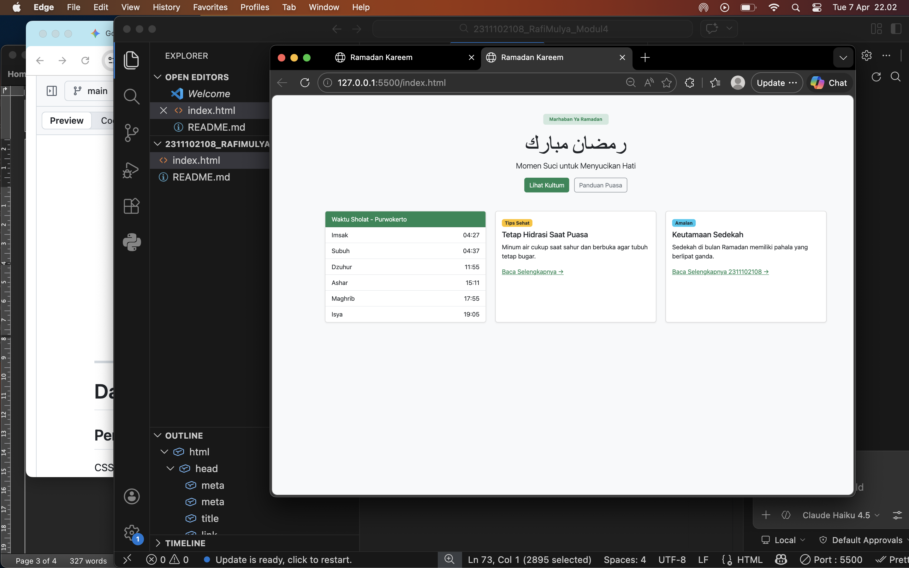

<div align="center">
  <br />
  <h1>LAPORAN PRAKTIKUM <br> APLIKASI BERBASIS PLATFORM </h1>
  <br />
  <h3>MODUL 4 <br> Bootstrap </h3>
  <br />
  
  <br />
  <br />
  <br />
  <h3>Disusun Oleh :</h3>
  <p>
    <strong>Rafi Mulya</strong>
    <br>
    <strong>2311102108</strong>
    <br>
    <strong>S1 IF-11-REG05</strong>
  </p>
  <br />
  <h3>Dosen Pengampu :</h3>
  <p>
    <strong>Dedi Agung Prabowo, S.Kom., M.Kom</strong>
  </p>
  <br />
  <br />
  <h4>Asisten Praktikum :</h4>
  <strong>Apri Pandu Wicaksono </strong>
  <br>
  <strong>Hamka Zaenul Ardi</strong>
  <br />
  <h3>LABORATORIUM HIGH PERFORMANCE <br>FAKULTAS INFORMATIKA <br>UNIVERSITAS TELKOM PURWOKERTO <br>2026 </h3>
</div>

<hr>

# Dasar Teori Bootstrap

## Pengertian Bootstrap
CSS (Cascading Style Sheets) adalah bahasa style sheet yang digunakan untuk mengatur tampilan dan format dokumen yang ditulis dalam bahasa markup (seperti HTML).

Jika HTML diibaratkan sebagai kerangka bangunan, maka CSS adalah cat, desain interior, dan estetikanya.

Fungsi Utama: Memisahkan konten (HTML) dari desain (CSS), memungkinkan konsistensi tampilan di seluruh halaman web, dan meningkatkan aksesibilitas serta kontrol tata letak.

Untuk mempercepat pengembangan, pengembang sering menggunakan framework yang sudah menyediakan class siap pakai, seperti:

Bootstrap: Berbasis komponen dan sistem grid yang matang.

Tailwind CSS: Berbasis utility-first untuk kustomisasi desain yang lebih fleksibel.

Bulma: Framework berbasis Flexbox yang modern.

## Contoh Implementasi
```html
<button class="btn btn-primary">Klik Saya</button>
```

### Source code - html
```html
<!DOCTYPE html>
<html lang="id">
<head>
  <meta charset="UTF-8">
  <meta name="viewport" content="width=device-width, initial-scale=1.0">
  <title>Ramadan Kareem</title>
  <!-- Bootstrap CSS -->
  <link href="https://cdn.jsdelivr.net/npm/bootstrap@5.3.3/dist/css/bootstrap.min.css" rel="stylesheet">
</head>
<body class="bg-light">

  <!-- Hero Section -->
  <div class="container text-center py-5">
    <span class="badge bg-success-subtle text-success px-3 py-2">Marhaban Ya Ramadan</span>
    <h1 class="display-4 mt-3">رمضان مبارك</h1>
    <p class="lead">Momen Suci untuk Menyucikan Hati</p>
    <div class="mt-3">
      <a href="#" class="btn btn-success me-2">Lihat Kultum</a>
      <a href="#" class="btn btn-outline-secondary">Panduan Puasa</a>
    </div>
  </div>

  <!-- Content Section -->
  <div class="container pb-5">
    <div class="row g-4">
      <!-- Waktu Sholat -->
      <div class="col-md-4">
        <div class="card shadow-sm">
          <div class="card-header bg-success text-white">
            Waktu Sholat - Purwokerto
          </div>
          <ul class="list-group list-group-flush">
            <li class="list-group-item d-flex justify-content-between">Imsak <span>04:27</span></li>
            <li class="list-group-item d-flex justify-content-between">Subuh <span>04:37</span></li>
            <li class="list-group-item d-flex justify-content-between">Dzuhur <span>11:55</span></li>
            <li class="list-group-item d-flex justify-content-between">Ashar <span>15:11</span></li>
            <li class="list-group-item d-flex justify-content-between">Maghrib <span>17:55</span></li>
            <li class="list-group-item d-flex justify-content-between">Isya <span>19:05</span></li>
          </ul>
        </div>
      </div>

      <!-- Tips -->
      <div class="col-md-4">
        <div class="card shadow-sm h-100">
          <div class="card-body">
            <span class="badge bg-warning text-dark mb-2">Tips Sehat</span>
            <h5 class="card-title">Tetap Hidrasi Saat Puasa</h5>
            <p class="card-text">Minum air cukup saat sahur dan berbuka agar tubuh tetap bugar.</p>
            <a href="#" class="text-success">Baca Selengkapnya →</a>
          </div>
        </div>
      </div>

      <!-- Amalan -->
      <div class="col-md-4">
        <div class="card shadow-sm h-100">
          <div class="card-body">
            <span class="badge bg-info text-dark mb-2">Amalan</span>
            <h5 class="card-title">Keutamaan Sedekah</h5>
            <p class="card-text">Sedekah di bulan Ramadan memiliki pahala yang berlipat ganda.</p>
            <a href="#" class="text-success">Baca Selengkapnya 2311102108 →</a>
          </div>
        </div>
      </div>
    </div>
  </div>

  <!-- Bootstrap JS -->
  <script src="https://cdn.jsdelivr.net/npm/bootstrap@5.3.3/dist/js/bootstrap.bundle.min.js"></script>
</body>
</html>

```
Output:



## Penjelasan
Website tersebut dirancang dengan konsep "Clean & Spiritual" yang mengandalkan sepenuhnya pada utility classes Bootstrap 5 untuk menciptakan tampilan modern tanpa kode CSS tambahan. Fokus utamanya adalah menyajikan informasi khas Ramadan, seperti jadwal imsakiyah dan kartu artikel, dalam tata letak yang responsif dan elegan.