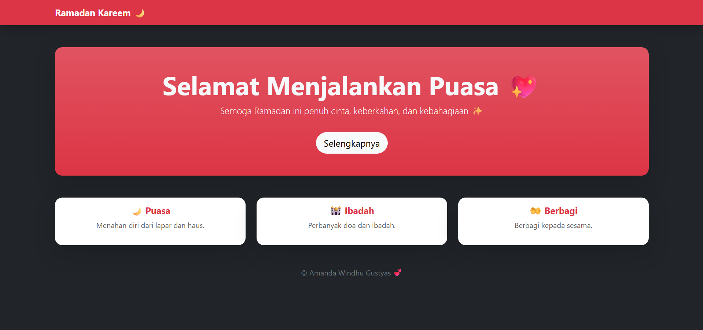

<div align="center">
  <br />
  <h1>LAPORAN PRAKTIKUM <br> APLIKASI BERBASIS PLATFORM </h1>
  <br />
  <h3>MODUL 4 <br> Bootstrap </h3>
  <br />
  
  <br />
  <br />
  <br />
  <h3>Disusun Oleh :</h3>
  <p>
    <strong>Amanda Windhu Gustyas</strong>
    <br>
    <strong>2311102121</strong>
    <br>
    <strong>S1 IF-11-REG05</strong>
  </p>
  <br />
  <h3>Dosen Pengampu :</h3>
  <p>
    <strong>Dedi Agung Prabowo, S.Kom., M.Kom</strong>
  </p>
  <br />
  <br />
  <h4>Asisten Praktikum :</h4>
  <strong>Apri Pandu Wicaksono </strong>
  <br>
  <strong>Hamka Zaenul Ardi</strong>
  <br />
  <h3>LABORATORIUM HIGH PERFORMANCE <br>FAKULTAS INFORMATIKA <br>UNIVERSITAS TELKOM PURWOKERTO <br>2026 </h3>
</div>

<hr>

# Dasar Teori

Bootstrap merupakan framework CSS yang digunakan untuk mempermudah proses pengembangan tampilan website secara cepat, responsif, dan konsisten tanpa harus menulis kode CSS dari awal. Bootstrap menyediakan berbagai komponen siap pakai seperti navbar, card, button, serta sistem grid berbasis row dan col yang memungkinkan pengaturan layout menjadi lebih terstruktur dan fleksibel pada berbagai ukuran layar. Selain itu, Bootstrap juga memiliki utility class seperti text-center, mt-5, p-3, dan shadow yang berfungsi untuk mengatur tampilan seperti posisi teks, margin, padding, serta efek visual secara praktis. Dengan adanya konsep responsive design, Bootstrap memungkinkan halaman web menyesuaikan tampilan secara otomatis pada perangkat desktop maupun mobile. Penggunaan Bootstrap dalam pengembangan web memberikan kelebihan berupa efisiensi waktu, konsistensi desain, kemudahan penggunaan, serta tampilan yang lebih modern dan profesional tanpa perlu banyak penyesuaian manual.

# Tugas 4
## Source Kode 
```
//2311102121
//Amanda Windhu Gustyas

<!DOCTYPE html>
<html lang="id">
<head>
    <meta charset="UTF-8">
    <title>Ramadan Kareem</title>

    <!-- Bootstrap -->
    <link href="https://cdn.jsdelivr.net/npm/bootstrap@5.3.2/dist/css/bootstrap.min.css" rel="stylesheet">
</head>

<body class="bg-dark text-light">

    <!-- Navbar -->
    <nav class="navbar navbar-dark bg-danger shadow">
        <div class="container">
            <span class="navbar-brand fw-bold">Ramadan Kareem 🌙</span>
        </div>
    </nav>

    <!-- Hero -->
    <div class="container text-center mt-5">
        <div class="p-5 bg-danger bg-gradient rounded-4 shadow-lg">
            <h1 class="display-4 fw-bold">Selamat Menjalankan Puasa 💖</h1>
            <p class="lead">
                Semoga Ramadan ini penuh cinta, keberkahan, dan kebahagiaan ✨
            </p>
            <button class="btn btn-light btn-lg mt-3 rounded-pill">
                Selengkapnya
            </button>
        </div>
    </div>

    <!-- Card Section -->
    <div class="container mt-5">
        <div class="row text-center g-4">

            <!-- Card 1 -->
            <div class="col-md-4">
                <div class="card border-0 shadow-lg rounded-4">
                    <div class="card-body">
                        <h5 class="fw-bold text-danger">🌙 Puasa</h5>
                        <p class="text-muted">Menahan diri dari lapar dan haus.</p>
                    </div>
                </div>
            </div>

            <!-- Card 2 -->
            <div class="col-md-4">
                <div class="card border-0 shadow-lg rounded-4">
                    <div class="card-body">
                        <h5 class="fw-bold text-danger">🕌 Ibadah</h5>
                        <p class="text-muted">Perbanyak doa dan ibadah.</p>
                    </div>
                </div>
            </div>

            <!-- Card 3 -->
            <div class="col-md-4">
                <div class="card border-0 shadow-lg rounded-4">
                    <div class="card-body">
                        <h5 class="fw-bold text-danger">🤲 Berbagi</h5>
                        <p class="text-muted">Berbagi kepada sesama.</p>
                    </div>
                </div>
            </div>

        </div>
    </div>

    <!-- Footer -->
    <footer class="text-center mt-5 mb-3">
        <p class="text-secondary">© Amanda Windhu Gustyas 💕</p>
    </footer>

</body>
</html>
```
Output:


# Penjelasan
Kode pada halaman ini menggunakan framework Bootstrap untuk membangun tampilan web bertema Ramadan secara cepat dan responsif tanpa menggunakan CSS manual. Struktur halaman terdiri dari beberapa komponen utama, yaitu navbar yang menggunakan class navbar untuk menampilkan judul halaman di bagian atas, kemudian section utama (hero) yang menggunakan class seperti container, p-5, bg-danger, rounded, dan shadow untuk membuat tampilan kotak besar dengan latar berwarna dan efek bayangan. Selanjutnya terdapat bagian card yang disusun menggunakan sistem grid Bootstrap (row dan col-md-4) untuk membagi konten menjadi tiga kolom yang responsif. Setiap card menggunakan class card, card-body, dan shadow untuk memberikan tampilan yang rapi dan modern. Selain itu, digunakan juga berbagai utility class seperti text-center, mt-5, fw-bold, dan btn untuk mengatur teks, jarak, serta tampilan tombol. Dengan memanfaatkan class bawaan Bootstrap, halaman ini menjadi lebih estetis, terstruktur, dan responsif tanpa perlu menambahkan styling CSS secara manual.

