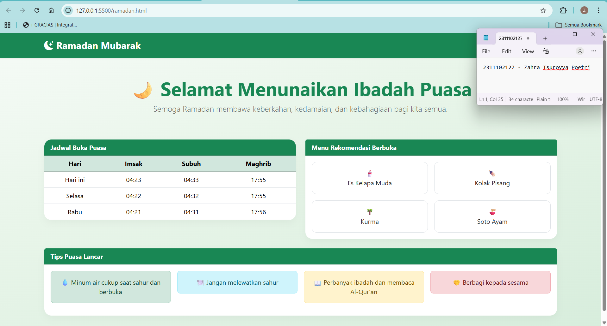

<div align="center">
  <br />
  <h1>LAPORAN PRAKTIKUM <br> APLIKASI BERBASIS PLATFORM </h1>
  <br />
  <h3>MODUL 4 <br> BOOTSTRAP </h3>
  <br />
  
  <br />
  <br />
  <br />
  <h3>Disusun Oleh :</h3>
  <p>
    <strong>Zahra Tsuroyya Poetri</strong>
    <br>
    <strong>2311102127</strong>
    <br>
    <strong>S1 IF-11-REG05</strong>
  </p>
  <br />
  <h3>Dosen Pengampu :</h3>
  <p>
    <strong>Dedi Agung Prabowo, S.Kom., M.Kom</strong>
  </p>
  <br />
  <br />
  <h4>Asisten Praktikum :</h4>
  <strong>Apri Pandu Wicaksono </strong>
  <br>
  <strong>Hamka Zaenul Ardi</strong>
  <br />
  <h3>LABORATORIUM HIGH PERFORMANCE <br>FAKULTAS INFORMATIKA <br>UNIVERSITAS TELKOM PURWOKERTO <br>2026</h3>
</div>

<hr>

### Dasar Teori

Bootstrap adalah framework CSS berbasis komponen yang digunakan untuk membangun antarmuka web secara cepat dan responsif. Framework ini menyediakan berbagai elemen siap pakai seperti grid system, tombol, navigasi, serta komponen UI lainnya yang memudahkan pengembang dalam mengatur tampilan website secara konsisten. Selain itu, Bootstrap juga didukung oleh plugin JavaScript yang membantu meningkatkan interaktivitas dan stabilitas dalam pengembangan antarmuka.

Bootstrap banyak digunakan baik dalam proyek pendidikan maupun aplikasi bisnis karena kemudahan penggunaan, dokumentasi yang lengkap, serta kemampuannya dalam mempercepat proses pengembangan website.

### Tugas 4 - Mode Suci (Edisi Ramadan)

#### Source Code 

```
<!DOCTYPE html>
<html lang="id">
<head>
    <meta charset="UTF-8">
    <meta name="viewport" content="width=device-width, initial-scale=1.0">
    <title>Ramadan</title>

    <link href="https://cdn.jsdelivr.net/npm/bootstrap@5.3.3/dist/css/bootstrap.min.css" rel="stylesheet">
    <link href="https://cdn.jsdelivr.net/npm/bootstrap-icons@1.11.3/font/bootstrap-icons.css" rel="stylesheet">
</head>

<body style="background: linear-gradient(160deg, #f6fbf7 0%, #e8f5e9 40%, #d7eddc 100%);">

    <!-- NAVBAR -->
    <nav class="navbar bg-success shadow-sm">
        <div class="container">
            <span class="navbar-brand text-white fw-bold fs-4">
                <i class="bi bi-moon-stars-fill"></i> Ramadan Mubarak
            </span>
        </div>
    </nav>

    <!-- UCAPAN -->
    <div class="container text-center py-5">
        <h1 class="display-5 text-success fw-bold">
            🌙 Selamat Menunaikan Ibadah Puasa
        </h1>
        <p class="lead text-muted">
            Semoga Ramadan membawa keberkahan, kedamaian, dan kebahagiaan bagi kita semua.
        </p>
    </div>

    <!-- KONTEN -->
    <div class="container pb-5">
        <div class="row g-4">

            <!-- JADWAL -->
            <div class="col-md-6">
                <div class="card border-0"
                     style="border-radius: 18px; overflow: hidden; box-shadow: 0 8px 20px rgba(0,0,0,0.04);">

                    <div class="card-header bg-success text-white fw-bold">
                        Jadwal Buka Puasa
                    </div>

                    <table class="table mb-0 text-center">
                        <thead class="table-success">
                            <tr>
                                <th>Hari</th>
                                <th>Imsak</th>
                                <th>Subuh</th>
                                <th>Maghrib</th>
                            </tr>
                        </thead>
                        <tbody>
                            <tr>
                                <td>Hari ini</td>
                                <td>04:23</td>
                                <td>04:33</td>
                                <td>17:55</td>
                            </tr>
                            <tr>
                                <td>Selasa</td>
                                <td>04:22</td>
                                <td>04:32</td>
                                <td>17:55</td>
                            </tr>
                            <tr>
                                <td>Rabu</td>
                                <td>04:21</td>
                                <td>04:31</td>
                                <td>17:56</td>
                            </tr>
                        </tbody>
                    </table>

                </div>
            </div>

            <!-- MENU -->
            <div class="col-md-6">
                <div class="card border-0"
                     style="border-radius: 18px; box-shadow: 0 8px 20px rgba(0,0,0,0.04);">

                    <div class="card-header bg-success text-white fw-bold">
                        Menu Rekomendasi Berbuka
                    </div>

                    <div class="card-body">
                        <div class="row text-center g-3">

                            <div class="col-6">
                                <div class="card h-100 border"
                                     style="border-radius: 12px;">
                                    <div class="card-body">
                                        🥤<br>Es Kelapa Muda
                                    </div>
                                </div>
                            </div>

                            <div class="col-6">
                                <div class="card h-100 border"
                                     style="border-radius: 12px;">
                                    <div class="card-body">
                                        🍢<br>Kolak Pisang
                                    </div>
                                </div>
                            </div>

                            <div class="col-6">
                                <div class="card h-100 border"
                                     style="border-radius: 12px;">
                                    <div class="card-body">
                                        🌴<br>Kurma
                                    </div>
                                </div>
                            </div>

                            <div class="col-6">
                                <div class="card h-100 border"
                                     style="border-radius: 12px;">
                                    <div class="card-body">
                                        🍜<br>Soto Ayam
                                    </div>
                                </div>
                            </div>

                        </div>
                    </div>

                </div>
            </div>

            <!-- TIPS -->
            <div class="col-12">
                <div class="card border-0"
                     style="border-radius: 18px; box-shadow: 0 8px 20px rgba(0,0,0,0.04);">

                    <div class="card-header bg-success text-white fw-bold">
                        Tips Puasa Lancar
                    </div>

                    <div class="card-body">
                        <div class="row g-3 text-center">

                            <div class="col-md-3">
                                <div class="alert alert-success rounded-3">
                                    💧 Minum air cukup saat sahur dan berbuka
                                </div>
                            </div>

                            <div class="col-md-3">
                                <div class="alert alert-info rounded-3">
                                    🍽 Jangan melewatkan sahur
                                </div>
                            </div>

                            <div class="col-md-3">
                                <div class="alert alert-warning rounded-3">
                                    📖 Perbanyak ibadah dan membaca Al-Qur'an
                                </div>
                            </div>

                            <div class="col-md-3">
                                <div class="alert alert-danger rounded-3">
                                    🤝 Berbagi kepada sesama
                                </div>
                            </div>

                        </div>
                    </div>

                </div>
            </div>

        </div>
    </div>

</body>
</html>

```

### Hasil Output



### Deskripsi Kode

Kode tersebut merupakan halaman web bertema Ramadan yang dibuat menggunakan HTML dengan memanfaatkan framework Bootstrap. Halaman ini dirancang untuk menampilkan beberapa informasi penting, seperti navbar sebagai header, ucapan Ramadan, jadwal buka puasa, menu rekomendasi berbuka, serta tips agar ibadah puasa dapat berjalan dengan lancar. Susunan elemen pada halaman dibuat secara terstruktur sehingga mudah dipahami oleh pengguna.

Penggunaan Bootstrap pada kode ini terlihat dari pemanfaatan berbagai komponen yang telah disediakan, seperti navbar untuk bagian header, grid system untuk mengatur tata letak agar responsif, card untuk mengelompokkan konten, table untuk menampilkan data jadwal, serta alert untuk menyajikan tips dengan tampilan yang lebih menarik. Selain itu, digunakan pula utility class untuk membantu proses styling secara cepat dan Bootstrap Icons untuk menambahkan elemen visual, sehingga tidak diperlukan penggunaan CSS secara manual.

Hasil output dari kode tersebut adalah sebuah halaman web bertema Ramadan dengan menampilkan informasi seputar Ramadan.

### Refrensi
[1] Santoso, M. (2025). Perbandingan efektivitas bootstrap dan tailwind CSS dalam pengembangan UI web responsif. Jurnal Teknologi dan Sistem Informasi Bisnis, 7(4), 489–497.

[2] Supriatmaja, G. A., Pratama, I. P. M. Y., Mahendra, K., Widyaputra, K. D. D., Deva, J., & Mahendra, G. S. (2022). Sistem Informasi Perpustakaan Menggunakan Framework Bootstrap Dengan PHP Native dan Database MySQL Berbasis Web Pada SMP Negeri 2 Dawan. Jurnal Teknologi Ilmu Komputer, 1(1), 7–15.