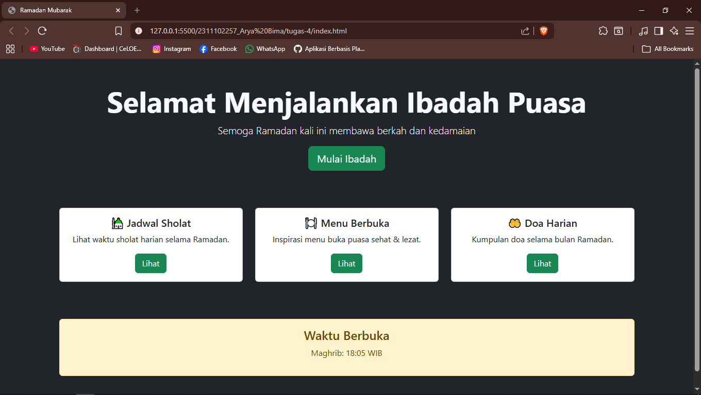

<div align="center">
  <br />
  <h1>LAPORAN PRAKTIKUM <br> APLIKASI BERBASIS PLATFORM </h1>
  <br />
  <h3>MODUL 4 <br> BOOTSTRAP </h3>
  <br />
  
  <br />
  <br />
  <br />
  <h3>Disusun Oleh :</h3>
  <p>
    <strong>Arya Bima</strong>
    <br>
    <strong>2311102257</strong>
    <br>
    <strong>S1 IF-11-REG05</strong>
  </p>
  <br />
  <h3>Dosen Pengampu :</h3>
  <p>
    <strong>Dedi Agung Prabowo, S.Kom., M.Kom</strong>
  </p>
  <br />
  <br />
  <h4>Asisten Praktikum :</h4>
  <strong>Apri Pandu Wicaksono </strong>
  <br>
  <strong>Hamka Zaenul Ardi</strong>
  <br />
  <h3>LABORATORIUM HIGH PERFORMANCE <br>FAKULTAS INFORMATIKA <br>UNIVERSITAS TELKOM PURWOKERTO <br>2026 </h3>
</div>

<hr>

# Dasar Teori

### 1. Pengertian Bootstrap

Bootstrap adalah framework CSS open-source yang dikembangkan oleh Twitter (sekarang X) pada tahun 2011. Bootstrap membantu developer membuat website yang responsif dan menarik dengan cepat tanpa harus menulis CSS dari nol.

Bootstrap menyediakan kumpulan komponen siap pakai seperti tombol, navbar, form, card, grid system, dan masih banyak lagi.

### 2. Keunggulan Bootstrap

- Responsive Design – otomatis menyesuaikan tampilan di semua ukuran layar (mobile, tablet, desktop).
- Cepat dan Mudah – tinggal pakai class yang sudah disediakan.
- Konsisten – desain seragam di seluruh halaman.
- Komponen Lengkap – tombol, modal, carousel, dropdown, dll.
- Grid System yang fleksibel (12 kolom).
- Didukung komunitas besar dan dokumentasi resmi yang baik.

### 3. Cara Menggunakan Bootstrap

Ada dua cara utama:

1. Melalui CDN (paling mudah untuk praktikum)

```html
<link
  href="https://cdn.jsdelivr.net/npm/bootstrap@5.3.3/dist/css/bootstrap.min.css"
  rel="stylesheet"
/>
<script src="https://cdn.jsdelivr.net/npm/bootstrap@5.3.3/dist/js/bootstrap.bundle.min.js"></script>
```

2. Mengunduh file Bootstrap dan menyimpannya di folder proyek.

### 4. Prinsip Penggunaan Bootstrap

- Bootstrap menggunakan class-based styling.
- Hindari menulis CSS terlalu banyak jika masih bisa pakai class Bootstrap.
- Gunakan semantic HTML + class Bootstrap agar kode tetap bersih.
- Selalu cek dokumentasi resmi Bootstrap untuk class terbaru.

---

# Tugas 4: Mode Suci (Edisi Ramadan)

```html
<!-- 2311102257 - Arya Bima -->
<!doctype html>
<html lang="id">
  <head>
    <meta charset="UTF-8" />
    <meta name="viewport" content="width=device-width, initial-scale=1" />
    <title>Ramadan Mubarak</title>
    <link
      href="https://cdn.jsdelivr.net/npm/bootstrap@5.3.3/dist/css/bootstrap.min.css"
      rel="stylesheet"
    />
  </head>
  <body class="bg-dark text-light">
    <!-- Hero -->
    <section class="container text-center py-5">
      <h1 class="display-4 fw-bold">Selamat Menjalankan Ibadah Puasa</h1>
      <p class="lead">Semoga Ramadan kali ini membawa berkah dan kedamaian</p>
      <button class="btn btn-success btn-lg">Mulai Ibadah</button>
    </section>

    <!-- Cards -->
    <section class="container py-4">
      <div class="row g-4">
        <div class="col-md-4">
          <div class="card text-dark">
            <div class="card-body text-center">
              <h5 class="card-title">🕌 Jadwal Sholat</h5>
              <p class="card-text">Lihat waktu sholat harian selama Ramadan.</p>
              <a href="#" class="btn btn-success">Lihat</a>
            </div>
          </div>
        </div>

        <div class="col-md-4">
          <div class="card text-dark">
            <div class="card-body text-center">
              <h5 class="card-title">🍽️ Menu Berbuka</h5>
              <p class="card-text">Inspirasi menu buka puasa sehat & lezat.</p>
              <a href="#" class="btn btn-success">Lihat</a>
            </div>
          </div>
        </div>

        <div class="col-md-4">
          <div class="card text-dark">
            <div class="card-body text-center">
              <h5 class="card-title">🤲 Doa Harian</h5>
              <p class="card-text">Kumpulan doa selama bulan Ramadan.</p>
              <a href="#" class="btn btn-success">Lihat</a>
            </div>
          </div>
        </div>
      </div>
    </section>

    <!-- Countdown / Info -->
    <section class="container py-5 text-center">
      <div class="alert alert-warning">
        <h4 class="alert-heading">Waktu Berbuka</h4>
        <p>Maghrib: 18:05 WIB</p>
      </div>
    </section>

    <script src="https://cdn.jsdelivr.net/npm/bootstrap@5.3.3/dist/js/bootstrap.bundle.min.js"></script>
  </body>
</html>
```

Output:


**Penjelasan:**
Kode di atas merupakan sebuah halaman web sederhana bertema Ramadan Mubarak yang dibangun menggunakan HTML5 dan Bootstrap 5. Halaman ini memiliki desain dark mode dengan latar belakang gelap dan teks terang, menampilkan hero section dengan ucapan selamat menjalankan puasa.
