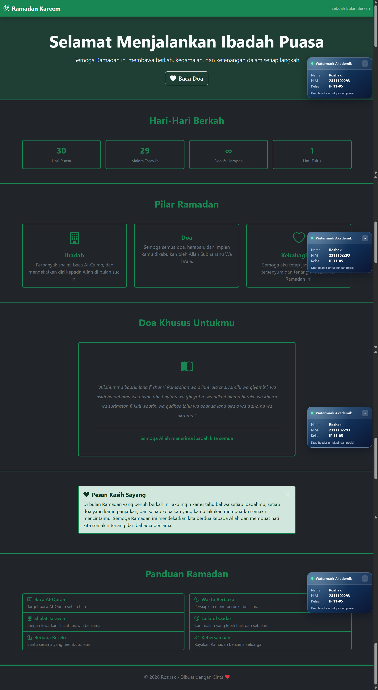

<div align="center">
    <br />
    <h1>LAPORAN PRAKTIKUM <br> APLIKASI BERBASIS PLATFORM </h1>
    <br />
    <h3>MODUL 5 <br> BOOTSTRAP </h3>
    <br />
    
    <br />
    <br />
    <br />
    <h3>Disusun Oleh :</h3>
    <p>
        <strong>Rozhak</strong>
        <br>
        <strong>2311102293</strong>
        <br>
        <strong>S1 IF-11-REG05</strong>
    </p>
    <br />
    <h3>Dosen Pengampu :</h3>
    <p>
        <strong>Dedi Agung Prabowo, S.Kom., M.Kom</strong>
    </p>
    <br />
    <br />
    <h4>Asisten Praktikum :</h4>
    <strong>Apri Pandu Wicaksono </strong>
    <br>
    <strong>Hamka Zaenul Ardi</strong>
    <br />
    <h3>LABORATORIUM HIGH PERFORMANCE <br>FAKULTAS INFORMATIKA <br>UNIVERSITAS TELKOM PURWOKERTO <br>2026 </h3>
</div>
<hr>

## Dasar Teori

Bootstrap merupakan **framework CSS** yang digunakan untuk mempercepat proses pengembangan tampilan web dengan menyediakan kumpulan class siap pakai. Dengan Bootsrap, developer tidak perlu menulis styling dari nol karena sudah tersedia komponen seperti grid system, navbar, card, button, utilities, yang dapat langsung digunakan untuk membangun antarmuka yang konsisten dan responsif.

Salah satu konsep utama dalam Bootstrap adalah **grid system**, yaitu sistem layout berbasis baris (`row`) dan kolom (`col`) yang memudahkan pengaturan posisi elemen secara fleksibel dan otomatis menyesuaikan berbagai ukuran layar. Hal ini menjadikan tampilan web lebih responsif tanpa perlu penulisan CSS tambahan.

Bootstrap juga menyediakan berbagai **komponen UI** seperti navbar, card, button, dan alert yang dapat digunakan dengan hanya menambahkan class tertentu pada elemen HTML. Selain itu, terdapat **utility class** seperti pengaturan warna (`bd-*`, `text-*`), spacing (`m-*`, `p-*`), serta alignment yang membantu mempercepat proses styling tanpa perlu membuat file CSS terpisah.

Dalam penggunaannya, Bootstrap biasanya diintegrasikan melalui **CDN (Content Delivery Network)** sehingga dapat langsung digunakan tanpa instalasi. Dengan pendekatan ini, pengembangan halaman menjadi lebih cepat, terstruktur, dan efisien, terutama untuk membangun tampilan modern berbasis komponen.

## Tugas 4: Mode Suci (Edisi Ramadan)

### 1. Source Code

```html
...
<body class="bg-dark text-light">

    <!-- Navbar -->
    <nav class="navbar navbar-dark sticky-top shadow" style="background-color: #0a2342;">
        ...
    </nav>

    <!-- Hero Section -->
    <section class="py-5 text-center border-bottom" style="background-color: #0f3460; border-color: #D4AF37 !important; border-width: 3px !important;">
        ...
    </section>

    <!-- Countdown Section -->
    <section class="py-5 border-bottom" style="border-color: #D4AF37 !important; border-width: 3px !important;">
        ...
    </section>

    <!-- Pilar Section -->
    <section class="py-5 border-bottom" style="border-color: #D4AF37 !important; border-width: 3px !important;">
        ...
    </section>

    <!-- Doa Section  -->
    <section class="py-5 border-bottom" id="doa" style="border-color: #D4AF37 !important; border-width: 3px !important;">
        ...
    </section>

    <!-- Pesan Akhir -->
    <section class="py-5 border-bottom" style="border-color: #D4AF37 !important; border-width: 3px !important;">
        <div class="container">
            <div class="row">
                <div class="col-lg-8 mx-auto">
                    <div class="alert alert-dismissible fade show border-3 shadow-sm" role="alert" style="background-color: rgba(212, 175, 55, 0.1); border-color: #D4AF37 !important;">
                        <h5 class="alert-heading fw-bold" style="color: #D4AF37;">
                            <i class="bi bi-suit-heart-fill me-2"></i>Pesan Kasih Sayang
                        </h5>
                        <p class="mb-0 text-light">
                            Di bulan Ramadan yang penuh berkah ini, aku ingin kamu tahu bahwa setiap 
                            ibadahmu, setiap doa yang kamu panjatkan, dan setiap kebaikan yang kamu lakukan 
                            membuatku semakin mencintaimu. Semoga Ramadan ini mendekatkan kita berdua kepada 
                            Allah dan membuat hati kita semakin tenang dan bahagia bersama.
                        </p>
                        <button type="button" class="btn-close btn-close-white" data-bs-dismiss="alert" aria-label="Close"></button>
                    </div>
                </div>
            </div>
        </div>
    </section>

    <!-- Resources Section -->
    <section class="py-5 border-bottom" style="border-color: #D4AF37 !important; border-width: 3px !important;">
        ...
    </section>

    <!-- Footer -->
    <footer class="text-center py-4 bg-dark border-top" style="border-color: #D4AF37 !important; border-width: 3px !important;">
        ...
    </footer>
</body>
...
```

**Kode Lengkap:** [index.html](index.html)

### 2. Penjelasan

Kode HTML pada halaman ini dibangun menggunakan **Bootstrap sebagai framwork utama** untuk mengatur layout, komponen, dan tampilan secara cepat dan konsisten. Elemen `<body>` menggunakan class `bg-dark` dan `text-light` untuk memberikan tema gelap dengan teks terang sehingga menciptakan kontras yang jelas dan sesuai nuansa Ramadhan.

Struktur halaman dibagi menjadi beberapa **section modular** seperti navbar, hero, countdown, pilar, doa, hingga, footer. Setiap section memanfaatkan class Bootstrap seperti `container`, `row`, dan `col` untuk mengatur layout berbasis grid agar responsif di berbagai ukuran layar. Class `py-5`, `text-center`, dan `border-bottom` digunakan untuk mengatur spacing, alignment, serta pemisah antar bagian tanpa perlu menulis CSS tambahan.

Navbar menggunakan class `navbar`, `sticky-top`, dan `shadow` untuk membuat navigasi tetap berad di atas saat scrolling serta memberikan efek bayangan agar terlihat lebih modern.

Pada bagian _Pesan Akhir_, digunakan komponen `alert` dari Bootstrap dengan tambahan class seperti `alert-dismissible`, `fade`, dan `show` untuk membuat elemen dapat ditutup secara interaktif. Tombol close (`btn-close`) terintegrasi dengan atribut `data-bs-dismiss="alert"` yang merupakan fitur bawaan Bootstrap tanpa perlu JavaScript tambahan dari user.

Secara keseluruhan, kode ini menunjukkan pemanfaatan Bootsrap dalam membangun halaman web yang terstruktur, responsif, dan konsisten dengan memaksimalkan class bawaan serta komponen UI tanpa bergantung pada styling manual.

### 3. Output



## Kesimpulan

Bootsrap memungkinkan pembuatan halaman web yang responsif dan terstruktur dengan cepat melalui pemanfaatan class dan komponen bawaan tanpa perlu menulis CSS secara kompleks.