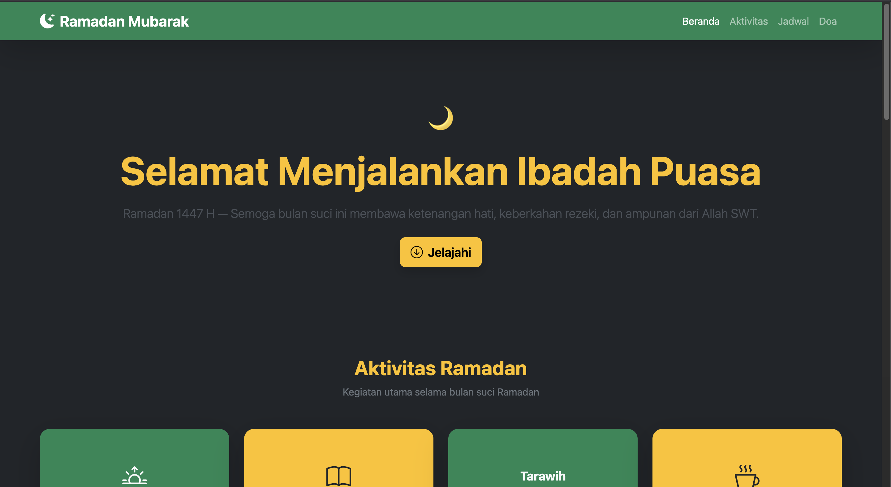

<div align="center">
  <br />
  <h1>LAPORAN PRAKTIKUM <br> APLIKASI BERBASIS PLATFORM </h1>
  <br />
  <h3>MODUL 4 <br> BOOTSTRAP </h3>
  <br />
  
  <br />
  <br />
  <br />
  <h3>Disusun Oleh :</h3>
  <p>
    <strong>Grashela Ayudia Prameswari</strong>
    <br>
    <strong>2311102318</strong>
    <br>
    <strong>S1 IF-11-REG05</strong>
  </p>
  <br />
  <h3>Dosen Pengampu :</h3>
  <p>
    <strong>Dedi Agung Prabowo, S.Kom., M.Kom</strong>
  </p>
  <br />
  <br />
  <h4>Asisten Praktikum :</h4>
  <strong>Apri Pandu Wicaksono </strong>
  <br>
  <strong>Hamka Zaenul Ardi</strong>
  <br />
  <h3>LABORATORIUM HIGH PERFORMANCE <br>FAKULTAS INFORMATIKA <br>UNIVERSITAS TELKOM PURWOKERTO <br>2026 </h3>
</div>

<hr>

## Dasar Teori

**Bootstrap** adalah framework CSS open-source yang dikembangkan oleh Twitter untuk mempercepat proses pengembangan antarmuka web yang responsif dan mobile-first. Bootstrap menyediakan kumpulan komponen UI siap pakai seperti navbar, card, table, carousel, accordion, dan lainnya, yang dapat langsung digunakan dengan menambahkan class pada elemen HTML tanpa perlu menulis CSS dari awal.

Salah satu keunggulan utama Bootstrap adalah sistem grid 12 kolom yang memungkinkan pengaturan layout secara fleksibel dan responsif. Dengan menggunakan class seperti `col-lg-*`, `col-md-*`, dan `col-sm-*`, tampilan halaman dapat menyesuaikan secara otomatis terhadap berbagai ukuran layar. Bootstrap juga menyediakan utility class untuk spacing (`p-*`, `m-*`), warna (`text-*`, `bg-*`), dan tipografi (`fw-bold`, `fs-*`) yang mempercepat proses styling.

Selain komponen visual, Bootstrap juga menyertakan JavaScript plugin untuk komponen interaktif seperti carousel, accordion (collapse), modal, dan navbar responsive (toggler). Plugin ini bekerja melalui atribut `data-bs-*` pada elemen HTML sehingga dapat digunakan tanpa menulis JavaScript tambahan. Kombinasi HTML semantik dengan class Bootstrap memungkinkan pembuatan halaman web yang profesional, konsisten, dan responsif secara efisien.

## Tugas 4: Halaman Ramadan Mubarak

### 1. Source Code

```html
<!-- 2311102318 -->
<!-- Grashela Ayudia Prameswari -->

<!DOCTYPE html>
<html lang="id">
<head>
    <meta charset="UTF-8">
    <meta name="viewport" content="width=device-width, initial-scale=1.0">
    <title>Ramadan Mubarak</title>

    <!-- Bootstrap CSS -->
    <link href="https://cdn.jsdelivr.net/npm/bootstrap@5.3.2/dist/css/bootstrap.min.css" rel="stylesheet">
    <!-- Bootstrap Icons -->
    <link href="https://cdn.jsdelivr.net/npm/bootstrap-icons@1.11.3/font/bootstrap-icons.min.css" rel="stylesheet">
</head>

<body class="bg-dark text-light">

    <!-- Navbar -->
    <nav class="navbar navbar-expand-lg navbar-dark bg-success shadow-lg">
        <div class="container">
            <a class="navbar-brand fw-bold fs-4" href="#">
                <i class="bi bi-moon-stars-fill me-2"></i>Ramadan Mubarak
            </a>
            <button class="navbar-toggler" type="button" data-bs-toggle="collapse" data-bs-target="#navMenu">
                <span class="navbar-toggler-icon"></span>
            </button>
            <div class="collapse navbar-collapse" id="navMenu">
                <ul class="navbar-nav ms-auto">
                    <li class="nav-item">
                        <a class="nav-link active" href="#beranda">Beranda</a>
                    </li>
                    <li class="nav-item">
                        <a class="nav-link" href="#aktivitas">Aktivitas</a>
                    </li>
                    <li class="nav-item">
                        <a class="nav-link" href="#jadwal">Jadwal</a>
                    </li>
                    <li class="nav-item">
                        <a class="nav-link" href="#doa">Doa</a>
                    </li>
                </ul>
            </div>
        </div>
    </nav>

    <!-- Hero Section -->
    <section id="beranda" class="container-fluid bg-dark text-center py-5">
        ...
    </section>

    <!-- Aktivitas Ramadan -->
    <section id="aktivitas" class="container py-5">
        ...
    </section>

    <!-- Jadwal Imsakiyah -->
    <section id="jadwal" class="container py-5">
        ...
    </section>

    <!-- Doa Ramadan -->
    <section id="doa" class="container py-5">
        ...
    </section>

    <!-- Carousel Motivasi -->
    <section class="container py-5">
        ...
    </section>

    <!-- Accordion Tips -->
    <section class="container py-5">
        ...
    </section>

    <!-- Footer -->
    <footer class="bg-success text-center py-4 shadow-lg">
        ...
    </footer>

    <!-- Bootstrap JS -->
    <script src="https://cdn.jsdelivr.net/npm/bootstrap@5.3.2/dist/js/bootstrap.bundle.min.js"></script>

</body>
</html>
```

**Kode HTML Lengkap:** [index.html](index.html)

### 2. Penjelasan

Kode HTML membangun halaman web bertema Ramadan Mubarak yang memanfaatkan framework Bootstrap 5 secara penuh untuk komponen dan layout. Halaman ini terdiri dari beberapa section utama yang masing-masing menggunakan komponen Bootstrap yang berbeda.

Pada bagian **Navbar**, digunakan komponen `navbar` Bootstrap dengan class `navbar-expand-lg` dan `navbar-dark bg-success` untuk membuat navigasi responsif berwarna hijau. Navbar dilengkapi `navbar-toggler` yang secara otomatis mengubah tampilan menjadi hamburger menu pada layar kecil melalui plugin `collapse` Bootstrap.

Bagian **Hero Section** menggunakan `container-fluid` dengan utility class Bootstrap seperti `text-center`, `py-5`, `display-3`, `fw-bold`, dan `text-warning` untuk menampilkan ucapan selamat Ramadan 1447 H. Terdapat juga tombol CTA menggunakan class `btn btn-warning btn-lg` dengan icon dari Bootstrap Icons.

Section **Aktivitas Ramadan** menampilkan empat kartu kegiatan (Sahur, Tadarus, Tarawih, Berbuka) menggunakan sistem grid Bootstrap `row` dan `col-lg-3 col-md-6` serta komponen `card` dengan variasi warna `bg-success` dan `bg-warning`. Setiap kartu menggunakan class `h-100` untuk tinggi seragam dan `rounded-4` untuk sudut membulat.

Bagian **Jadwal Imsakiyah** menggunakan komponen `table` Bootstrap dengan class `table-dark table-striped table-hover` untuk menampilkan jadwal sholat wilayah Purwokerto. Tabel dibungkus dalam `table-responsive` agar tetap dapat di-scroll pada layar kecil, dan menggunakan `badge` Bootstrap untuk penanda waktu penting.

Section **Doa Ramadan** menampilkan dua kartu doa (Niat Puasa dan Berbuka Puasa) menggunakan komponen `card` dengan `card-header` yang diberi warna berbeda (`bg-success` dan `bg-warning`). Teks Arab ditampilkan dengan atribut `dir="rtl"` untuk penulisan kanan ke kiri.

Bagian **Carousel Motivasi** menggunakan komponen `carousel` Bootstrap dengan `carousel-indicators`, `carousel-inner`, dan kontrol navigasi prev/next. Carousel menampilkan tiga slide berisi hadits motivasi dengan background `bg-success` dan elemen `blockquote` Bootstrap.

Section **Accordion Tips** menggunakan komponen `accordion` Bootstrap untuk menampilkan empat tips Ramadan secara collapse/expand. Setiap `accordion-item` menggunakan atribut `data-bs-toggle="collapse"` dan `data-bs-parent` untuk mengatur perilaku buka-tutup otomatis.

Bagian **Footer** menggunakan class `bg-success text-center py-4` dengan informasi identitas pembuat (NIM 2311102318 - Grashela Ayudia Prameswari).

### 3. Output



## Kesimpulan

Penggunaan framework Bootstrap 5 secara signifikan mempercepat proses pengembangan halaman web yang responsif dan konsisten. Dengan memanfaatkan komponen siap pakai seperti Navbar, Card, Table, Carousel, dan Accordion, halaman Ramadan Mubarak dapat dibangun secara efisien tanpa perlu menulis CSS custom. Sistem grid Bootstrap memastikan layout yang fleksibel di berbagai ukuran layar, sementara utility class menyederhanakan proses styling. Kombinasi komponen Bootstrap dengan Bootstrap Icons menghasilkan halaman web bertema Ramadan yang profesional, interaktif, dan fully responsive.
